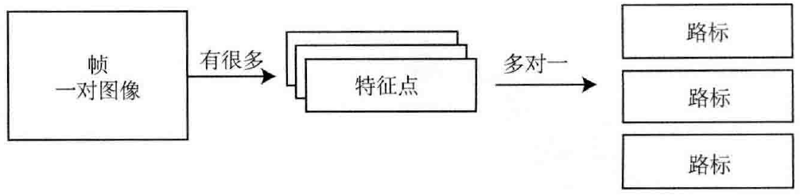
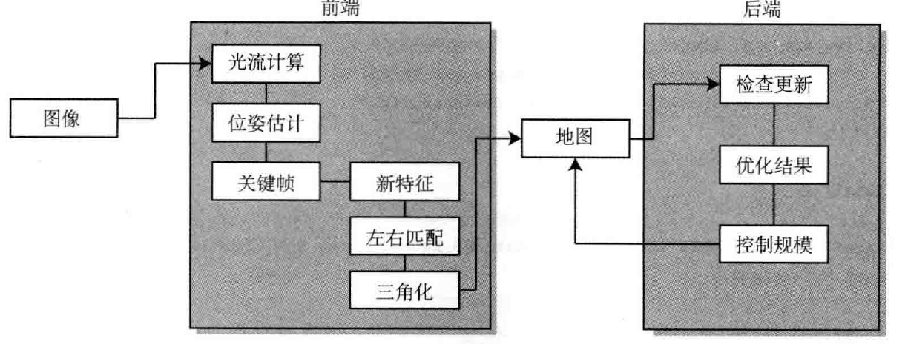

[TOC]

# 确定核心算法结构

* 处理的最基本单元是**图像**。在双目视觉里，就是**一对图像**。称为**一帧**
* 对帧提取**特征**。这些特征是很多 2D 的点
* 在图像之间寻找特征的关联。如果能多次看到某个特征，就可以用三角化方法计算它的 3D 位置，即**路标**。

显然，**图像**、**特征**和**路标**是这个系统中最基本的结构。

整个程序有两个重要模块：

* **前端**：往前端插入图像帧，前端负责提取图像中的特征，然后与上一帧进行光流追踪，通过光流结果计算该帧的定位。必要时，应该补充新的特征点并做三角化前端处理的结果将作为后端优化的初始值
* **后端**：是一个较慢的线程，它拿到处理之后的关键帧和路标点，对它们进行优化，然后返回优化结果。后端应该控制优化问题的规模在一定范围内，不能随时间一直增长

在前后端之间放了一个**地图**模块来处理它们之间的数据流动。前后端在分别的线程中处理数据，我们预想的流程应该是前端提取了关键帧后，往地图中添加新数据；后端检测到地图更新时，运行一次优化，然后把地图中旧的关键帧和地图点去掉，保持优化的规模

## 前端

前端的处理逻辑：

1. 前端本身有**初始化**、**正常追踪**、**追踪丢失**三种状态
2. **初始化状态**中，根据左右目之间的光流匹配，寻找可以三角化的地图点，成功时建立初始地图
3. **追踪阶段**中，前端计算上一帧特征点到当前帧的光流，根据光流结果计算图像位姿。该计算**只使用左目图像**，不使用右目
4. 如果追踪到的点较少，就判定**当前帧为关键帧**。对于关键帧，做以下几件事：
   * 提取新的特征点
   * 找到这些点在右图的对应点，用三角化建立新的路标点
   * 将新的关键帧和路标点加人地图，并触发一次后端优化
5. 如果追踪丢失，就重置前端系统，重新初始化
