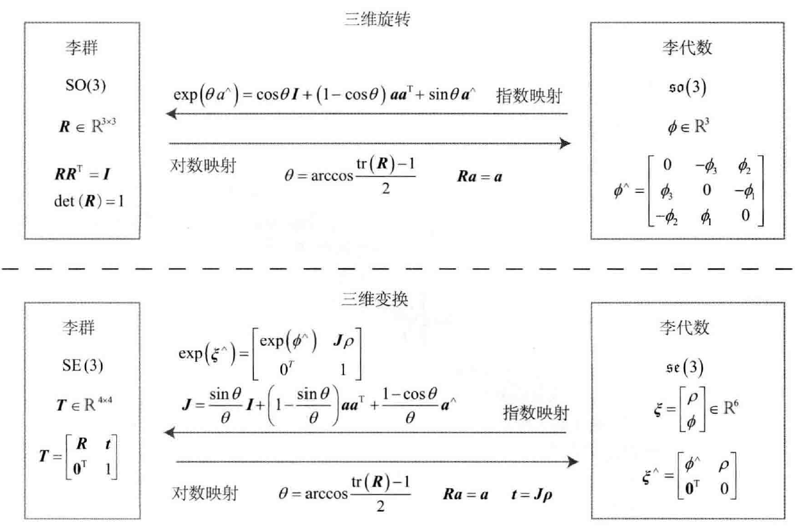

[TOC]

先前提到的旋转矩阵与变换矩阵对于加法不封闭、但对乘法封闭。即
$$
\boldsymbol{R}_1+\boldsymbol{R}_2\notin \mathrm{SO}(3),\quad\boldsymbol{T}_1+\boldsymbol{T}_2\notin \mathrm{SE}(3)\\
\boldsymbol{R}_1\boldsymbol{R}_2\in \mathrm{SO}(3),\quad\boldsymbol{T}_1\boldsymbol{T}_2\in \mathrm{SE}(3)
$$

# 基础定义

## 群 Group

定义：**一种集合**加上**一种运算**的代数结构。把集合记作 $A$ ，运算记作 $\cdot$ ，则群可以记作 $G=(A,\cdot)$ 

群要求运算满足的条件（封结幺逆）：

* 封闭性：$\forall a_1,a_2\in A,\quad a_1\cdot a_2\in A$ 
* 结合律：$\forall a_1,a_2,a_3\in A,\quad(a_1\cdot a_2)\cdot a_3=a_1\cdot(a_2\cdot a_3)$ 
* 幺元：$\exist a_0\in A,\quad\mathrm{s.t.}\quad \forall a\in A,\quad a_0\cdot a=a\cdot a_0=a$ 
* 逆：$\forall a\in A,\quad \exist a^{-1}\in A,\quad\mathrm{s.t.}\quad a\cdot a^{-1}=a_0$ 

矩阵中常见的群：

* 一般线性群 $\mathrm{GL}(n)$ ：指 $n\times n$ 的**可逆**矩阵，它们对**矩阵乘法**成群
* 特殊正交群 $\mathrm{SO}(n)$ ：旋转矩阵群，$\mathrm{SO}(2),\mathrm{SO}(3)$ 比较常见
* 特殊欧式群 $\mathrm{SE}(n)$ ：$n$ 维欧式变换，$\mathrm{SE}(2),\mathrm{SE}(3)$ 比较常见

**李群**：具有**连续（光滑）**性质的群

## 李代数

每个李群都有与之对应的李代数，李代数描述了李群的**局部性质**，准确的说，是**单位元**附近的**正切空间**

定义：由**一个集合** $\mathbb{V}$ ，**一个数域** $\mathbb{F}$ 和**一个二元运算**（李括号） $[,]$ 组成，则该李代数记作 $\mathfrak{g}=(\mathbb{V},\mathbb{F},[,])$ 

李代数必须满足：

* 封闭性：$\forall \boldsymbol{X},\boldsymbol{Y}\in \mathbb{V},\quad[\boldsymbol{X},\boldsymbol{Y}]\in \mathbb{V}$ 

* 双线性：$\forall \boldsymbol{X},\boldsymbol{Y},\boldsymbol{Z}\in \mathbb{V},\quad a,b\in\mathbb{F}$ 有
  $$
  \begin{array}{l}[a\boldsymbol{X}+b\boldsymbol{Y},\boldsymbol{Z}]=a[\boldsymbol{X},\boldsymbol{Z}]+b[\boldsymbol{Y},\boldsymbol{Z}]\\ [\boldsymbol{Z},a\boldsymbol{X}+b\boldsymbol{Y}]=a[\boldsymbol{Z},\boldsymbol{X}]+b[\boldsymbol{Z},\boldsymbol{Y}]\end{array}
  $$

* 自反性：$\forall \boldsymbol{X}\in \mathbb{V},\quad [\boldsymbol{X},\boldsymbol{X}]=\boldsymbol{0}$ 

* 雅可比等价：$\forall \boldsymbol{X},\boldsymbol{Y},\boldsymbol{Z}\in \mathbb{V},\quad [\boldsymbol{X},[\boldsymbol{Y},\boldsymbol{Z}]]+[\boldsymbol{Z},[\boldsymbol{X},\boldsymbol{Y}]]+[\boldsymbol{Y},[\boldsymbol{Z},\boldsymbol{X}]]=\boldsymbol{0}$ 

相比于群中较为简单的二元运算，李括号表达了两个元素的差异，它不要求结合律，而要求元素和自己做李括号之后为零的性质。

## 李代数的引出

对于旋转矩阵 $\boldsymbol{R}$ ，有 $\boldsymbol{R}\boldsymbol{R}^T=\boldsymbol{I}$ ，当其随时间连续地变化作为时间的函数 $\boldsymbol{R}(t)$ 有 $\boldsymbol{R}(t)\boldsymbol{R}(t)^T=\boldsymbol{I}$ ，对时间求导后有
$$
\dot{\boldsymbol{R}}(t)\boldsymbol{R}(t)^T+\boldsymbol{R}(t)\dot{\boldsymbol{R}}(t)^T=0\\
\dot{\boldsymbol{R}}(t)\boldsymbol{R}(t)^T=-\left(\dot{\boldsymbol{R}}(t)\boldsymbol{R}(t)^T\right)^T
$$
引入 $^\vee$ 符号作为反对称矩阵运算符 $^\wedge$ 的逆运算，有
$$
\boldsymbol{a}^\wedge=\boldsymbol{A},\quad \boldsymbol{A}^\vee=\boldsymbol{a}
$$
由于 $\dot{\boldsymbol{R}}(t)\boldsymbol{R}(t)^T$ 是反对称矩阵，可以找到一个三维向量 $\phi(t)\in\mathbb{R}^3$ 与之对应，即
$$
\dot{\boldsymbol{R}}(t)\boldsymbol{R}(t)^T=\phi(t)^\wedge
$$
右乘 $\boldsymbol{R}(t)$ ，有
$$
\dot{\boldsymbol{R}}(t)=\phi(t)^\wedge\boldsymbol{R}(t)
$$
因此对 $\boldsymbol{R}(t)$ 求导等价于左乘 $\phi(t)^\wedge$ ，设 $\boldsymbol{R}(0)=\boldsymbol{I}$ 并将 $\boldsymbol{R}(t)$ 在 $t=0$ 附近进行一阶泰勒展开：
$$
\boldsymbol{R}(t)\approx\boldsymbol{R}(t_0)+\dot{\boldsymbol{R}}(t_0)(t-t_0)=\boldsymbol{I}+\phi(t_0)^\wedge(t)
$$

从中得到，$\phi$ 反应了 $\boldsymbol{R}$ 的导数性质，故称它在 $\mathrm{SO}(3)$ 原点附近的正切空间 (Tangent Space) 上

在 $t_0$ 附近，设 $\phi$ 保持为常数 $\phi(t_0)=\phi_0$ ，则有
$$
\dot{\boldsymbol{R}}(t)=\phi(t_0)^\wedge\boldsymbol{R}(t)=\phi_0^\wedge\boldsymbol{R}(t)
$$
考虑初值 $\boldsymbol{R}(0)=\boldsymbol{I}$ ，解微分方程得到
$$
\boldsymbol{R}(t)=\exp(\phi_0^\wedge t)
$$

## 李代数 $\mathfrak{so}(3)$

$\mathrm{SO}(3)$ 对应的李代数是定义在 $\mathbb{R}^3$ 上的向量，记作 $\phi$ ，每个 $\phi$ 都可以生成一个反对称矩阵：
$$
\mathit{\Phi}=\phi^\wedge=\begin{bmatrix}0&-\phi_3&\phi_2\\\phi_3&0&-\phi_1\\-\phi_2&\phi_1&0\end{bmatrix}\in\mathbb{R}^{3\times 3}
$$
在此定义下，两个向量 $\phi_1,\phi_2$ 的李括号为
$$
[\phi_1,\phi_2]=(\mathit{\Phi}_1\mathit{\Phi}_2-\mathit{\Phi}_2\mathit{\Phi}_1)^\vee
$$
由于向量 $\phi$ 和反对称矩阵是一一对应的，在不引起歧义的情况下，就说 $\mathfrak{so}(3)$ 的元素是**三维向量**或者**三维反对称矩阵**
$$
\mathfrak{so}(3)=\{\phi\in\mathbb{R}^3,\mathit{\Phi}=\phi^\wedge\in\mathbb{R}^{3\times 3}\}
$$
也即，$\mathfrak{so}(3)$ 是一个由**三维向量**组成的集合，每个向量对应一个反对称矩阵，用于表达旋转矩阵的导数，其与 $\mathrm{SO}(3)$ 的关系由指数映射确定
$$
\boldsymbol{R}=\exp(\phi^\wedge)
$$

## 李代数 $\mathfrak{se}(3)$

$$
\mathfrak{se}(3)=\left\{ \boldsymbol{\xi}=\begin{bmatrix}\boldsymbol{\rho}\\\phi\end{bmatrix}\in\mathbb{R}^6,\boldsymbol{\rho}\in\mathbb{R}^3,\phi\in\mathfrak{so}(3),\boldsymbol{\xi}^\wedge=\begin{bmatrix}\phi^\wedge&\boldsymbol{\rho}\\\bold{0}^T&0\end{bmatrix}\in\mathbb{R}^{4\times 4} \right\}
$$

其中，$\boldsymbol{\xi}$ 是一个六维向量，前三维为平移，记作 $\boldsymbol{\rho}$ ，后三维为旋转，记作 $\phi$ ，实质上是 $\mathfrak{so}(3)$ 元素。此外，在 $\mathfrak{se}(3)$ 中使用 $^\wedge$ 符号将一个六维向量转换成四维矩阵，这里不表示反对称

同样地，有李括号
$$
[\boldsymbol{\xi}_1,\boldsymbol{\xi}_2]=(\boldsymbol{\xi}_1^\wedge\boldsymbol{\xi}_2^\wedge-\boldsymbol{\xi}_2^\wedge\boldsymbol{\xi}_1^\wedge)^\vee
$$

# 指数与对数映射

## $\mathfrak{so}(3)$ 的指数映射

任意矩阵的指数映射都可以写成一个泰勒展开，但只在收敛的情况下才会有结果，其结果仍是一个矩阵
$$
\exp{(A)}=\sum_{n=0}^{\infty}{\frac{1}{n!}A^n}
$$
同样地，对于 $\mathfrak{so}(3)$ 中的任意元素 $\phi$ ，同上定义其指数映射
$$
\exp(\phi^\wedge)=\sum_{n=0}^{\infty}{\frac{1}{n!}(\phi^\wedge)^n}
$$
一种**便于计算**的映射方式：

定义三维向量 $\phi$ 的模长和方向为 $\theta,\boldsymbol{a}$ ，于是有：$\phi=\theta\boldsymbol{a}$ 

关于方向向量 $\boldsymbol{a}$ 有：$\|\boldsymbol{a}\|=1$ ，且对于 $\boldsymbol{a}^\wedge$ 有如下两条性质：

* $$
  \boldsymbol{a}^\wedge\boldsymbol{a}^\wedge=\begin{bmatrix}-a_2^2-a_3^2&a_1a_2&a_1a_3\\a_1a_2&-a_1^2-a_3^2&a_2a_3\\a_1a_3&a_2a_3&-a_1^2-a_2^2\end{bmatrix}=\boldsymbol{a}\boldsymbol{a}^T-\boldsymbol{I}
  $$

* $$
  \boldsymbol{a}^\wedge\boldsymbol{a}^\wedge\boldsymbol{a}^\wedge=\boldsymbol{a}^\wedge(\boldsymbol{a}\boldsymbol{a}^T-\boldsymbol{I})=-\boldsymbol{a}^\wedge
  $$

从这两个性质出发，可以处理 $\boldsymbol{a}^\wedge$ 的高阶项，则指数映射可以写成
$$
\begin{split}
\exp(\phi^\wedge)&=\exp(\theta\boldsymbol{a}^\wedge)=\sum_{n=0}^{\infty}{\frac{1}{n!}(\theta\boldsymbol{a}^\wedge)^n}\\
&=\boldsymbol{I}+\theta\boldsymbol{a}^\wedge+\frac{1}{2!}\theta^2\boldsymbol{a}^\wedge\boldsymbol{a}^\wedge+\frac{1}{3!}\theta^3\boldsymbol{a}^\wedge\boldsymbol{a}^\wedge\boldsymbol{a}^\wedge+\frac{1}{4!}\theta^4(\boldsymbol{a}^\wedge)^4+\cdots\\
&=\boldsymbol{a}\boldsymbol{a}^T-\boldsymbol{a}^\wedge\boldsymbol{a}^\wedge+\theta\boldsymbol{a}^\wedge+\frac{1}{2!}\theta^2\boldsymbol{a}^\wedge\boldsymbol{a}^\wedge-\frac{1}{3!}\theta^3\boldsymbol{a}^\wedge-\frac{1}{4!}\theta^4\boldsymbol{a}^\wedge\boldsymbol{a}^\wedge+\cdots\\
&=\boldsymbol{a}\boldsymbol{a}^T+(\theta-\frac{1}{3!}\theta^3+\frac{1}{5}\theta^5-\cdots)\boldsymbol{a}^\wedge-(1-\frac{1}{2!}\theta^2+\frac{1}{4!}\theta^4-\cdots)\boldsymbol{a}^\wedge\boldsymbol{a}^\wedge\\
&=\boldsymbol{a}^\wedge\boldsymbol{a}^\wedge+\boldsymbol{I}+\sin\theta\boldsymbol{a}^\wedge-\cos\theta\boldsymbol{a}^\wedge\boldsymbol{a}^\wedge\\
&=(1-\cos\theta)\boldsymbol{a}^\wedge\boldsymbol{a}^\wedge+\boldsymbol{I}+\sin\theta\boldsymbol{a}^\wedge\\
&=\cos\theta\boldsymbol{I}+(1-\cos\theta)\boldsymbol{a}\boldsymbol{a}^T+\sin\theta\boldsymbol{a}^\wedge
\end{split}
$$
也即，
$$
\exp(\theta\boldsymbol{a}^\wedge)=\cos\theta\boldsymbol{I}+(1-\cos\theta)\boldsymbol{a}\boldsymbol{a}^T+\sin\theta\boldsymbol{a}^\wedge
$$
对比**罗德里格斯公式**
$$
\boldsymbol{R}=\cos\theta\boldsymbol{I}+(1-\cos\theta)\boldsymbol{n}\boldsymbol{n}^T+\sin\theta\boldsymbol{n}^\wedge
$$
实际上，$\mathfrak{so}(3)$ 就是**旋转向量组成的空间**，指数映射即**罗德里格斯**公式。由此，将 $\mathfrak{so}(3)$ 中任意一个向量对应到了一个位于 $\mathrm{SO}(3)$ 中的旋转矩阵。反之，若定义对数映射，也可将 $\mathrm{SO}(3)$ 中的元素对应到 $\mathfrak{so}(3)$ 中：
$$
\phi=\ln(\boldsymbol{R})^\vee=\left(\sum_{n=0}^{\infty}{\frac{(-1)^n}{n+1}(\boldsymbol{R}-\boldsymbol{I})^{n+1}}\right)^\vee
$$

* 指数映射是满射而非单射，$\mathrm{SO}(3)$ 中的元素和 $\mathfrak{so}(3)$ 中的元素是**一对多**的关系
* 考虑旋转角 $\theta$ 具有周期性，若将旋转角限制在 $\pm\pi$ 之间，则李群和李代数是一一对应的

**关于对数映射的计算**：利用迹的性质求解转角和转轴，从而求得旋转向量，即李代数

## $\mathfrak{se}(3)$ 的指数映射

$$
\exp(\boldsymbol{\xi}^\wedge)=\begin{bmatrix}\sum_{n=0}^{\infty}{\frac{1}{n!}(\phi^\wedge)^n}&\sum_{n=0}^{\infty}{\frac{1}{(n+1)!}(\phi^\wedge)^n\boldsymbol{\rho}}\\\boldsymbol{0}^T&1\end{bmatrix}\triangleq\begin{bmatrix}\boldsymbol{R}&\boldsymbol{J}\boldsymbol{\rho}\\\boldsymbol{0}^T&1\end{bmatrix}=\boldsymbol{T}
$$

同理推导有
$$
\sum_{n=0}^{\infty}{\frac{1}{(n+1)!}(\phi^\wedge)^n}=\frac{\sin\theta}{\theta}\boldsymbol{I}+\left(1-\frac{\sin\theta}{\theta}\right)\boldsymbol{a}\boldsymbol{a}^T+\frac{1-\cos\theta}{\theta}\boldsymbol{a}^\wedge\triangleq\boldsymbol{J}
$$
平移部分经过指数映射后，发生了一次以 $\boldsymbol{J}$ 为系数矩阵的线性变换

**关于对数映射的计算**：从左上角的旋转矩阵求解旋转向量，而右上角的 $\boldsymbol{t}$ 满足 $\boldsymbol{t}=\boldsymbol{J}\boldsymbol{\rho}$ ，而 $\boldsymbol{J}$ 由 $\phi$ 得到所以可以通过求解线性方程解得 $\boldsymbol{\rho}$ ，从而求得李代数

# 李代数求导与扰动模型

## Baker-Campbell-Hausdorff (BCH) 公式

$$
\begin{split}
\ln&(\exp(\boldsymbol{A})\exp(\boldsymbol{B}))\\
&=\boldsymbol{A}+\boldsymbol{B}+\frac{1}{2}[\boldsymbol{A},\boldsymbol{B}]+\frac{1}{12}[\boldsymbol{A},[\boldsymbol{A},\boldsymbol{B}]]-\frac{1}{12}[\boldsymbol{B},[\boldsymbol{A},\boldsymbol{B}]]+\cdots
\end{split}
$$

当处理两个矩阵指数之积时，它们会产生一些由李括号组成的余项。

特别地，考虑 $\mathrm{SO}(3)$ 上的李代数 $\ln(\exp(\phi_1^\wedge)\exp(\phi_2^\wedge))^\vee$ ，当 $\phi_1$ 或 $\phi_2$ 为小量时，小于二次以上的项都可以被忽略，此时 BCH 拥有**线性近似表达**：
$$
\ln(\exp(\phi_1^\wedge)\exp(\phi_2^\wedge))^\vee\approx\left\{\begin{array}{l}\boldsymbol{J}_l(\phi_2)^{-1}\phi_1+\phi_2&当\phi_1为小量\\\boldsymbol{J}_r(\phi_1)^{-1}\phi_2+\phi_1&当\phi_2为小量\end{array}\right.
$$

* 当对一个旋转矩阵 $\boldsymbol{R}_2$ 左乘一个微小旋转矩阵 $\boldsymbol{R}_1$ 时，可以近似地看作，在原有的李代数 $\phi_2$ 上加了一项 $\boldsymbol{J}_l(\phi_2)^{-1}\phi_1$ 
* 当对一个旋转矩阵 $\boldsymbol{R}_1$ 右乘一个微小旋转矩阵 $\boldsymbol{R}_2$ 时，可以近似地看作，在原有的李代数 $\phi_1$ 上加了一项 $\boldsymbol{J}_r(\phi_1)^{-1}\phi_2$ 

其中，左乘 BCH 近似雅可比 $\boldsymbol{J}_l$ 为
$$
\boldsymbol{J}_l=\boldsymbol{J}=\frac{\sin\theta}{\theta}\boldsymbol{I}+\left(1-\frac{\sin\theta}{\theta}\right)\boldsymbol{a}\boldsymbol{a}^T+\frac{1-\cos\theta}{\theta}\boldsymbol{a}^\wedge
$$
其逆为
$$
\boldsymbol{J}_l^{-1}=\frac{\theta}{2}\cot\frac{\theta}{2}\boldsymbol{I}+\left(1-\frac{\theta}{2}\cot\frac{\theta}{2}\right)\boldsymbol{a}\boldsymbol{a}^T-\frac{\theta}{2}\boldsymbol{a}^\wedge
$$
右乘即对自变量取负
$$
\boldsymbol{J}_r(\phi)=\boldsymbol{J}_l(-\phi)
$$
由此得到李代数微积分的理论基础
$$
\exp(\Delta\phi^\wedge)\exp(\phi^\wedge)=\exp\left((\phi+\boldsymbol{J}_l^{-1}(\phi)\Delta\phi)^\wedge\right)\\
\exp\left((\phi+\Delta\phi)^\wedge\right)=\exp\left((\boldsymbol{J}_l\Delta\phi)^\wedge\right)\exp(\phi^\wedge)=\exp(\phi^\wedge)\exp\left((\boldsymbol{J}_r\Delta\phi)^\wedge\right)
$$
同理对 $\mathrm{SE}(3)$ 有类似的 BCH 近似：
$$
\exp(\Delta\boldsymbol{\xi}^\wedge)\exp(\boldsymbol{\xi}^\wedge)\approx\exp\left((\mathcal{J}_l^{-1}\Delta\boldsymbol{\xi}+\boldsymbol{\xi})^\wedge\right)\\
\exp(\boldsymbol{\xi}^\wedge)\exp(\Delta\boldsymbol{\xi}^\wedge)\approx\exp\left((\mathcal{J}_r^{-1}\Delta\boldsymbol{\xi}+\boldsymbol{\xi})^\wedge\right)
$$

## $\mathrm{SO}(3)$ 上的李代数求导

在 SLAM 中，要估计一个相机的位姿，该位姿是由 $\mathrm{SO}(3)$ 上的旋转矩阵或 $\mathrm{SE}(3)$ 上的变换矩阵描述的。设某时刻相机的位姿为 $\boldsymbol{T}$ ，观察到了一个世界坐标位于 $\boldsymbol{p}$ 的点，产生了一个观测数据 $\boldsymbol{z}$ ，则有
$$
\boldsymbol{z}=\boldsymbol{T}\boldsymbol{p}+\boldsymbol{w}
$$
其中 $\boldsymbol{w}$ 是随机噪声，由于它的存在需要计算理想观测与实际观测的误差
$$
\boldsymbol{e}=\boldsymbol{z}-\boldsymbol{T}\boldsymbol{p}
$$
假设共有 $N$ 个这样的路标点和观测，于是有了 $N$ 个上式，那么位姿估计的问题就转化为了最小化整体误差以寻找最优 $T$ 的问题
$$
\min_{\boldsymbol{T}}J(\boldsymbol{T})=\sum_{i=1}^{N}{\|\boldsymbol{z}_i-\boldsymbol{T}\boldsymbol{p}_i\|_2^2}
$$
求解此问题需要计算目标函数 $J$ 关于变换矩阵 $\boldsymbol{T}$ 的导数。

在和上面相似的问题中，**经常会构建与位姿有关的函数，然后讨论该函数关于位姿的导数，以调整当前的估计值**。但，$\mathrm{SO}(3),\mathrm{SE}(3)$ 上**并没有良好定义的加法**，如果把 $\boldsymbol{T}$ 当成一个普通矩阵来处理优化就必须对它**加以约束**。而李代数**由向量组成，具有良好的加法运算**，用李代数解决求导问题有两种思路：

* 用**李代数表示姿态**，然后根据李代数加法对**李代数求导**
* 对李群**左乘**或**右乘**微小扰动，然后**对该扰动求导**，称为**左扰动和右扰动**模型

## 李代数求导

考虑 $\mathrm{SO}(3)$ ，假设对空间点 $\boldsymbol{p}$ 进行了旋转，得到了 $\boldsymbol{R}\boldsymbol{p}$ ，计算旋转之后点坐标相对于旋转的导数
$$
\frac{\partial(\boldsymbol{R}\boldsymbol{p})}{\partial\boldsymbol{R}}
$$
由于 $\mathrm{SO}(3)$ 没有加法，所以该导数无法按照导数定义进行计算，设 $\boldsymbol{R}$ 对应的李代数为 $\phi$ ，则
$$
\frac{\partial(\exp(\phi^\wedge)\boldsymbol{p})}{\partial\phi}=\lim_{\delta\phi\rightarrow0}{\frac{\exp\left((\phi+\delta\phi)^\wedge\right)\boldsymbol{p}-\exp(\phi^\wedge)\boldsymbol{p}}{\delta\phi}}=-(\boldsymbol{R}\boldsymbol{p})^\wedge\boldsymbol{J}_l
$$
由此得到旋转后的点相对于李代数的导数：
$$
\frac{\partial(\boldsymbol{R}\boldsymbol{p})}{\partial\phi}=(-\boldsymbol{R}\boldsymbol{p})^\wedge\boldsymbol{J}_l
$$

## 扰动模型（左乘）

对 $\boldsymbol{R}$ 进行一次扰动 $\Delta\boldsymbol{R}$，看结果相对于扰动的变化率。

设左扰动 $\Delta\boldsymbol{R}$ 对应的李代数为 $\boldsymbol{\varphi}$ ，然后对 $\boldsymbol{\varphi}$ 求导
$$
\frac{\partial(\boldsymbol{R}\boldsymbol{p})}{\partial\boldsymbol{\varphi}}=\lim_{\boldsymbol{\varphi}\rightarrow0}{\frac{\exp(\boldsymbol{\varphi}^\wedge)\exp(\phi^\wedge)\boldsymbol{p}-\exp(\phi^\wedge)\boldsymbol{p}}{\boldsymbol{\varphi}}}=-(\boldsymbol{R}\boldsymbol{p})^\wedge
$$
扰动模型可以省去一个雅可比 $\boldsymbol{J}_l$ 的计算

## $\mathrm{SE}(3)$ 上的李代数求导

假设某空间点 $\boldsymbol{p}$ 经过一次变换 $\boldsymbol{T}$ （对应的李代数为 $\boldsymbol{\xi}$ ），得到 $\boldsymbol{T}\boldsymbol{p}$ 

给 $\boldsymbol{T}$ 左乘一个扰动 $\Delta\boldsymbol{T}=\exp(\delta\boldsymbol{\xi}^\wedge)$ ，设扰动项的李代数为 $\delta\boldsymbol{\xi}=[\delta\boldsymbol{\rho},\delta\phi]^T$ ，则
$$
\begin{split}
\frac{\partial(\boldsymbol{T}\boldsymbol{p})}{\partial\delta\boldsymbol{\xi}}&=\lim_{\delta\boldsymbol{\xi}\rightarrow\boldsymbol{0}}\frac{\exp(\delta\boldsymbol{\xi}^\wedge)\exp(\boldsymbol{\xi}^\wedge)\boldsymbol{p}-\exp(\boldsymbol{\xi^\wedge})\boldsymbol{p}}{\delta\boldsymbol{\xi}}\\
&=\begin{bmatrix}\boldsymbol{I}&-(\boldsymbol{R}\boldsymbol{p}+\boldsymbol{t})^\wedge\\\boldsymbol{0}^T&\boldsymbol{0}^T\end{bmatrix}\triangleq(\boldsymbol{Tp})^\odot
\end{split}
$$
最后的结果被定义为一个算符 $^\odot$ ，它把一个齐次坐标的空间点变换成一个 $4\times 6$ 的矩阵

# 相似变换群和李代数

在单目情况下，一般会显式地把尺度因子表达出来
$$
\boldsymbol{p}'=\begin{bmatrix}s\boldsymbol{R}&\boldsymbol{t}\\\boldsymbol{0}^T&1\end{bmatrix}\boldsymbol{p}=s\boldsymbol{R}\boldsymbol{p}+\boldsymbol{t}
$$
相似变换群：
$$
\mathrm{Sim}(3)=\left\{\boldsymbol{S}=\begin{bmatrix}s\boldsymbol{R}&\boldsymbol{t}\\\boldsymbol{0}^T&1\end{bmatrix}=\in\mathbb{R}^{4\times 4}\right\}
$$
李代数：
$$
\mathfrak{sim}(3)=\left\{\boldsymbol{\zeta|\zeta}=\begin{bmatrix}\boldsymbol{\rho}\\\boldsymbol{\phi}\\\sigma\end{bmatrix}\in\mathbb{R}^7,\boldsymbol{\zeta}^\wedge=\begin{bmatrix}\sigma\boldsymbol{I}+\phi^\wedge&\boldsymbol{\rho}\\\boldsymbol{0}^T&0\end{bmatrix}\in\mathbb{R}^{4\times 4}\right\}
$$
指数映射为：
$$
\exp(\boldsymbol{\zeta^\wedge})=\begin{bmatrix}e^\sigma\exp(\phi^\wedge)&\boldsymbol{J}_s\boldsymbol{\rho}\\\boldsymbol{0}^T&1\end{bmatrix}
$$
其中，$\boldsymbol{J}_s$ 的形式为
$$
\begin{split}
\boldsymbol{J}_s&=\frac{e^\sigma-1}{\sigma}\boldsymbol{I}+\frac{\sigma e^\sigma\sin\theta+(1-e^\sigma\cos\theta)\theta}{\sigma^2+\theta^2}\boldsymbol{a}^\wedge\\
&+\left(\frac{e^\sigma-1}{\sigma}-\frac{(\sigma e^\sigma\cos\theta-1)\sigma+(e^\sigma\sin\theta)\theta}{\sigma^2+\theta^2}\right)\boldsymbol{a}^\wedge\boldsymbol{a}^\wedge
\end{split}
$$
李代数 $\boldsymbol{\zeta}$ 与李群的对应关系为
$$
s=e\sigma,\quad \boldsymbol{R}=\exp(\phi^\wedge),\quad \boldsymbol{t}=\boldsymbol{J}_s\boldsymbol{\rho}
$$
设给予 $\boldsymbol{Sp}$ 左侧一个小扰动 $\exp(\boldsymbol{\xi}^\wedge)$ ，并求 $\boldsymbol{Sp}$ 关于扰动的导数。由于 $\boldsymbol{Sp}$ 是四维的齐次坐标，$\boldsymbol{\zeta}$ 是七维向量，所以该导数应该是 $4\times 7$ 的雅可比。方便起见，记 $\boldsymbol{Sp}$ 的前三维组成向量 $\boldsymbol{q}$ ，则：
$$
\frac{\partial\boldsymbol{Sp}}{\partial\boldsymbol{\zeta}}=\begin{bmatrix}\boldsymbol{I}&-\boldsymbol{q}^\wedge&\boldsymbol{q}\\\boldsymbol{0}^T&\boldsymbol{0}^T&0\end{bmatrix}
$$
