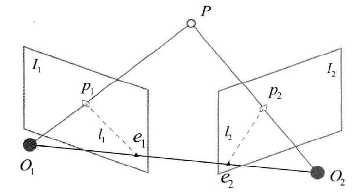

[TOC]

**核心问题**：如何根据图像估计相机运动

主要方法：**特征点法**和**直接法**

# 特征点

经典 SLAM 模型中的**路标**点在视觉 SLAM 任务中是指**图像特征**

特征是图像信息的另一种数字表达形式，应当在相机运动后保持稳定

SIFT、SURF、ORB 等人工设计的特征点拥有性质：

* 可重复性 (Repeatability)：相同的特征可以在不同的图像中找到
* 可区别性 (Distinctiveness)：不同的特征有不同的表达
* 高效率 (Efficiency)：同一图像中，特征点的数量应远小于像素的数量
* 本地性 (Locality)：特征仅与一小片图像区域相关

特征点由两部分组成：关键点 (Key-point) 和描述子 (Descriptor)

# ORB 特征 Oriented FAST and Rotated BRIEF

关键点：Oriented FAST

描述子：BRIEF

## FAST 关键点

基本思想：一个像素与邻域的像素差别过大，那么它更可能是角点（仅需比较像素亮度的大小）

1. 在图像中选取像素 $p$ ，设其亮度为 $I_p$ 
2. 设置阈值 $T$ （如 $I_p$ 的20%）
3. 以像素 $p$ 为中心，选取半径为3的圆上的16个像素点
4. 假如选取的圆上有连续 $N$ 个点的亮度大于或小于 $I_p\pm T$ ，则像素 $p$ 可以被认为是特征点（ $N$ 常取12，9，11）
5. 遍历像素执行上述操作

FAST-12 的**预测试**操作：对于每个像素，直接检测其邻域圆上第1，5，9，13个像素的亮度，只有其中有3个同时大于或小于 $I_p\pm T$ 时当前像素才可能是一个角点

FAST 的**缺点**：重复性不强、分布不均匀、不具有方向信息、存在尺度问题

尺度问题：构建图像金字塔

方向信息：计算特征点附近的图像灰度质心（以图像块灰度值作为权重的中心）

* 在一个小的图像块 $B$ 中，定义图像块的矩为
  $$
  m_{pq}=\sum_{x,y\in B}{x^py^qI(x,y)},\quad p,q=\{0,1\}
  $$

* 通过矩可以找到图像块的质心：
  $$
  C=(\frac{m_{10}}{m_{00}},\frac{m_{01}}{m_{00}})
  $$

* 连接图像块的几何中心 $O$ 与质心 $C$ ，得到一个方向向量 $\overrightarrow{OC}$ ，于是特征点的方向可以定义为
  $$
  \theta=\arctan(m_{01}/m_{10})
  $$

## BRIEF 描述子

**二进制**描述子，描述向量由0和1组成，编码了关键点附近两个随机像素 ($p,q$) 的大小关系：$p>q$ 则取1，反之取0

BRIEF **缺点**：不具有旋转不变性

改进：利用在 FAST 特征点提取阶段计算的关键点方向信息，计算旋转之后的 Steer BRIEF 特征

## 特征匹配

方法：暴力匹配 Brute-Force Matcher；快速近似最近邻 FLANN 

常用于描述二进制描述子相似程度的距离：汉明距离 Hamming Distance

# 2D-2D 对极几何

## 对极约束

**极平面** Epipolar plane：$O_1,O_2,P$ 确定的一个平面

**极点** Epipoles：$O_1,O_2$ 连线与像平面 $I_1,I_2$ 的交点 $e_1,e_2$ 

**极线** Epipolar line：极平面与像平面 $I_1,I_2$ 之间的相交线 $l_1,l_2$ 

**基线** baseline：相机中心连线 $O_1O_2$

从第一帧的角度看，射线 $\overrightarrow{O_1p_1}$ 是某个像素可能出现的空间位置，而其对应的可能出现在第二幅图上的投影位置为 $\overrightarrow{e_2p_2}$ 

设 $P$ 的空间位置为：
$$
\boldsymbol{P}=[X,Y,Z]^T
$$
两个像素点的像素位置为：
$$
s_1\boldsymbol{p}_1=\boldsymbol{KP},\quad s_2\boldsymbol{p}_2=\boldsymbol{K}(\boldsymbol{RP}+\boldsymbol{t})
$$
具体的，这里计算的是 $\boldsymbol{R}_{21},\boldsymbol{t}_{21}$ 

* **尺度意义下相等** equal up to a scale：在使用齐次坐标时，一个向量将等于它自身乘上任意的非零常数，记作 $s\boldsymbol{p}\simeq\boldsymbol{p}$ 

则上述投影关系可以写作：
$$
\boldsymbol{p}_1\simeq \boldsymbol{KP},\quad \boldsymbol{p}_2\simeq\boldsymbol{K}(\boldsymbol{RP}+\boldsymbol{t})
$$
取 $\boldsymbol{x}_1=\boldsymbol{K}^{-1}\boldsymbol{p}_1,\quad \boldsymbol{x}_2=\boldsymbol{K}^{-1}\boldsymbol{p}_2$ 得到两个像素点在归一化平面上的坐标，代入可得
$$
\boldsymbol{x}_2=\boldsymbol{R}\boldsymbol{x}_1+\boldsymbol{t}
$$
两边左乘 $\boldsymbol{t}^\wedge$ 后左乘 $\boldsymbol{x}_2^T$ 得到**对极约束**
$$
\boldsymbol{x}_2^T\boldsymbol{t}^\wedge\boldsymbol{R}\boldsymbol{x}_1=0\\
\boldsymbol{p}_2^T\boldsymbol{K}^{-T}\boldsymbol{t}^\wedge\boldsymbol{R}\boldsymbol{K}^{-1}\boldsymbol{p}_1=0
$$
对极约束的**几何意义**：$O_1,P,O_2$ 共面，其中同时包含了平移和旋转

* **基础矩阵** Fundamental Matrix: $\boldsymbol{F}=\boldsymbol{K}^{-T}\boldsymbol{E}\boldsymbol{K}^{-1}$ 
* **本质矩阵** Essential Matrix: $\boldsymbol{E}=\boldsymbol{t}^\wedge\boldsymbol{R}$ 
* **对极约束**：$\boldsymbol{x}_2^T\boldsymbol{E}\boldsymbol{x}_1=\boldsymbol{p}_2^T\boldsymbol{F}\boldsymbol{p}_1=0$ 

则相机位姿估计问题转化为：

* 根据配对点的像素位置求出 $\boldsymbol{E}$ 或 $\boldsymbol{F}$ 
* 根据 $\boldsymbol{E}$ 或 $\boldsymbol{F}$ 求出 $\boldsymbol{R,t}$ 

## 本质矩阵

本质矩阵的约束：

* $\boldsymbol{E}$ 在**不同尺度下是等价**的：对 $\boldsymbol{E}$ 乘以任何非零常数后，对极约束仍然满足
* $\boldsymbol{E}$ 的**内在性质**：$\boldsymbol{E}$ 的奇异值必定是 $[\sigma,\sigma,0]^T$ 的形式
* 由于平移旋转各有3个自由度，故 $\boldsymbol{t}^\wedge\boldsymbol{R}$ 共有6个自由度；但考虑到尺度等价性 $\boldsymbol{E}$ 实际上有5个自由度

### 八点法求解本质矩阵

考虑一对匹配点，归一化坐标为 $\boldsymbol{x}_1=[u_1,v_1,1]^T,\quad \boldsymbol{x}_2=[u_2,v_2,1]^T$ ，根据对极约束，有：
$$
\begin{pmatrix}u_2&v_2&1\end{pmatrix}\begin{pmatrix}e_1&e_2&e_3\\e_4&e_5&e_6\\e_7&e_8&e_9\end{pmatrix}\begin{pmatrix}u_1\\v_1\\1\end{pmatrix}=0
$$
把矩阵 $\boldsymbol{E}$ 展开写成向量形式：$\boldsymbol{e}=[e_1,e_2,e_3,e_4,e_5,e_6,e_7,e_8,e_9]^T$ ，则对极约束写作：
$$
[u_2u_1,u_2v_1,u_2,v_2u_1,v_2v_1,v_2,u_1,v_1,1]\boldsymbol{e}=0
$$
对所有八对匹配点得到线性方程组：
$$
\begin{pmatrix}
  u_2^1u_1^1 & u_2^1v_1^1 & u_2^1 & v_2^1u_1^1 & v_2^1v_1^1 & v_2^1 & u_1^1 & v_1^1 & 1\\
  u_2^2u_1^2 & u_2^2v_1^2 & u_2^2 & v_2^2u_1^2 & v_2^2v_1^2 & v_2^2 & u_1^2 & v_1^2 & 1\\
  \vdots & \vdots & \vdots & \vdots & \vdots & \vdots & \vdots & \vdots & \vdots\\
  u_2^8u_1^8 & u_2^8v_1^8 & u_2^8 & v_2^8u_1^8 & v_2^8v_1^8 & v_2^8 & u_1^8 & v_1^8 & 1\\
  \end{pmatrix}
  \begin{pmatrix}
  e_1\\
  e_2\\
  e_3\\
  e_4\\
  e_5\\
  e_6\\
  e_7\\
  e_8\\
  \end{pmatrix}
  =0
$$

### 奇异值分解恢复相机运动

设 $\boldsymbol{E}$ 的 SVD 为：
$$
\boldsymbol{E}=\boldsymbol{U\Sigma V}^T
$$
其中 $\boldsymbol{U,V}$ 为正交阵，$\boldsymbol{\Sigma}$ 为奇异值矩阵，由 $\boldsymbol{E}$ 的内在性质可得 $\boldsymbol{\Sigma}=\text{diag}(\sigma,\sigma,0)$ 。在 SVD 分解中，对任意一个 $\boldsymbol{E}$ ，存在两个可能的 $\boldsymbol{R,t}$ 与之对应：
$$
\boldsymbol{t}^{\wedge}_1=\boldsymbol{UR}_Z(\frac{\pi}{2})\boldsymbol{\Sigma U}^T,\quad \boldsymbol{R}_1=\boldsymbol{UR}_Z^T(\frac{\pi}{2})\boldsymbol{V}^T\\
\boldsymbol{t}^{\wedge}_2=\boldsymbol{UR}_Z(-\frac{\pi}{2})\boldsymbol{\Sigma U}^T,\quad \boldsymbol{R}_2=\boldsymbol{UR}_Z^T(-\frac{\pi}{2})\boldsymbol{V}^T
$$
其中，$\boldsymbol{R}_Z(\frac{\pi}{2})$ 表示沿 $Z$ 轴旋转90°得到旋转矩阵。同时由于 $-\boldsymbol{E}$ 与 $\boldsymbol{E}$ 等价，因此从 $\boldsymbol{E}$ 分解到 $\boldsymbol{R,t}$ 时，共存在4个可能的解

最后将任意一点代入到四种解中，只有一个解在两个相机中都具有正的深度，此为正解。

由线性方程求解出的 $\boldsymbol{E}$ 可能不满足其内在性质，因此会调整 $\boldsymbol{\Sigma}$ 矩阵的形式：
$$
\boldsymbol{E}=\boldsymbol{U}\text{diag}(\frac{\sigma_1+\sigma_2}{2}+\frac{\sigma_1+\sigma_2}{2},0)\boldsymbol{V}^T
$$

## 单应矩阵 Homography

描述两个平面之间的映射关系

设图像 $I_1,I_2$ 有一对匹配好的特征点 $p_1,p_2$ ，特征点落在平面 $P$ 上，设平面满足方程：
$$
\boldsymbol{n}^T\boldsymbol{P}+d=0\\
-\frac{\boldsymbol{n}^T\boldsymbol{P}}{d}=1
$$
则有：
$$
\begin{split}
\boldsymbol{p}_2&\simeq\boldsymbol{K}(\boldsymbol{R}\boldsymbol{P}+\boldsymbol{t})\simeq\boldsymbol{K}\left(\boldsymbol{R}\boldsymbol{P}+\boldsymbol{t}\cdot(-\frac{\boldsymbol{n}^T\boldsymbol{P}}{d})\right)\\
&\simeq\boldsymbol{K}\left(\boldsymbol{R}-\frac{\boldsymbol{tn}^T}{d}\right)\boldsymbol{K}^{-1}\boldsymbol{p}_1
\end{split}
$$
于是得到了直接描述图像坐标 $\boldsymbol{p}_1,\boldsymbol{p}_2$ 之间的变换，中间记作 $\boldsymbol{H}$ 有：
$$
\boldsymbol{p}_2\simeq\boldsymbol{H}\boldsymbol{p}_1
$$

### 直接线性变换法 Direct Linear Transformer, DLT

把 $\boldsymbol{H}$ 矩阵看作向量，通过解该向量的线性方程来恢复 $\boldsymbol{H}$ 

展开：
$$
\begin{pmatrix}u_2\\v_2\\1\end{pmatrix}\simeq\begin{pmatrix}h_1&h_2&h_3\\h_4&h_5&h_6\\h_7&h_8&h_9\end{pmatrix}\begin{pmatrix}u_1\\v_1\\1\end{pmatrix}
$$
由于 $\simeq$ 带有的尺度等价性，可以令 $h_9=1$ ，整理得到：
$$
h_1u_1+h_2v_1+h_3-h_7u_1u_2-h_8v_1u_2=u_2\\
h_4u_1+h_5v_1+h_6-h_7u_1v_2-h_8v_1v_2=v_2
$$
则一组匹配点对构造出两项约束，于是自由度为8的单应矩阵可以通过4对匹配特征点算出，即求解：
$$
\begin{pmatrix}
u_1^1&v_1^1&1&0&0&0&-u_1^1u_2^1&-v_1^1u_2^1\\
0&0&0&u_1^1&v_1^1&1&-u_1^1v_2^1&-v_1^1v_2^1\\
u_1^2&v_1^2&1&0&0&0&-u_1^2u_2^2&-v_1^2u_2^2\\
0&0&0&u_1^2&v_1^2&1&-u_1^2v_2^2&-v_1^2v_2^2\\
u_1^3&v_1^3&1&0&0&0&-u_1^3u_2^3&-v_1^3u_2^3\\
0&0&0&u_1^3&v_1^3&1&-u_1^3v_2^3&-v_1^3v_2^3\\
u_1^4&v_1^4&1&0&0&0&-u_1^4u_2^4&-v_1^4u_2^4\\
0&0&0&u_1^4&v_1^4&1&-u_1^4v_2^4&-v_1^4v_2^4\\
\end{pmatrix}
\begin{pmatrix}
h_1\\h_2\\h_3\\h_4\\h_5\\h_6\\h_7\\h_8
\end{pmatrix}=
\begin{pmatrix}
u_2^1\\v_2^1\\u_2^2\\v_2^2\\u_2^3\\v_2^3\\u_2^4\\v_2^4
\end{pmatrix}
$$
与本质矩阵类似，通过数值法或解析法对单应矩阵进行分解后，计算每组解对应场景点所在平面法向量进行进一步筛选得到相应的 $\boldsymbol{R,t}$ 

单应性的**重要意义**：当特征点共面或相机发生纯旋转时，基础矩阵的**自由度下降**，出现**退化 (degenerate)**，如果继续使用八点法求解基础矩阵，其多出来的自由度将会主要由噪声决定。为了避免退化的影响，通常会**同时估计**基础矩阵 $\boldsymbol{F}$ 和单应矩阵 $\boldsymbol{H}$ ，选择重投影误差比较小的那个作为最终的运动估计矩阵

## 一些补充

### 尺度不确定性

单目 SLAM 的**初始化**：单目视觉中，对两张图像的 $\boldsymbol{t}$ 归一化相当于**固定了尺度**。初始化的两张图像必须有一定程度的平移，而后的轨迹和地图都将以此步的平移为单位。

### 初始化的纯旋转问题

从 $\boldsymbol{E}$ 分解到 $\boldsymbol{R,t}$ 的过程中，如果相机发生的是纯旋转，导致 $\boldsymbol{t}$ 为零，则 $\boldsymbol{E}$ 也为零，无从求解 $\boldsymbol{R}$ 。此时依靠 $\boldsymbol{H}$ 求解旋转，但仅有旋转也无法用三角测量估计特征点的空间位置。

* 单目初始化不能只有纯旋转，必须有一定程度的平移

### 多于8对点的情况

当给定点数多于8对时，可以计算最小二乘解，将对极约束左侧系数矩阵记作 $\boldsymbol{A}$ ：
$$
\boldsymbol{Ae}=\boldsymbol{0}
$$
该超定方程可以通过最小化一个二次型来求 $\boldsymbol{e}$ ：
$$
\min_{\boldsymbol{e}}{\|\boldsymbol{Ae}\|_2^2}=\min_{\boldsymbol{e}}{\boldsymbol{e}^T\boldsymbol{A}^T\boldsymbol{Ae}}
$$
考虑到可能存在误匹配的情况，通常倾向于使用随机采样一致性 (Random Sample Consensus, RANSAC) 来求解

# 三角测量

通过不同位置对同一个路标点进行观察，从观察到的位置推断路标点的距离

设 $\boldsymbol{x}_1,\boldsymbol{x}_2$ 为两个特征点的归一化坐标，则其满足：
$$
s_2\boldsymbol{x}_2=s_1\boldsymbol{Rx}_1+\boldsymbol{t}
$$
在已知 $\boldsymbol{R,t}$ 的情况下，想要计算 $s_1$ 则两侧左乘 $\boldsymbol{x}_2^{\wedge}$ ：
$$
s_2\boldsymbol{x}_2^{\wedge}\boldsymbol{x}_2=0=s_1\boldsymbol{x}_2^{\wedge}\boldsymbol{Rx}_1+\boldsymbol{x}_2^{\wedge}\boldsymbol{t}
$$
由最小二乘可求得两个深度 $s_1,s_2$ 

## 三角测量的矛盾

当平移量很小时，像素上的不确定性将导致较大的深度不确定性；当平移量较大时，在同样相机分辨率下，三角化测量将更加精确

因此要提高三角测量的精度：

* **提高特征点的提取精度**，即提高图像分辨率；但会导致图像变大，增加计算成本
* **使平移量增大**，但会导致图像的外观发生明显的变化，外观变化会使得特征提取与匹配变得困难；也即，增大平移可能导致匹配失效，而平移太小则三角化精度不够

# 3D-2D PnP

Perspective-n-Point, 是求解 3D 到 2D 点对运动的方法，描述了当知道 $n$ 个 3D空间点及其投影位置时，如何估计相机的位姿

* 2D-2D 的对极几何方法需要8个或8个以上的点对，且存在初始化、纯旋转、尺度等问题
* 3D-2D 的方法（一张图像的特征点的 3D 位置已知），那么最少只需3个点对就可以估计相机运动（以及至少一个额外点验证结果）

特征点的 3D 位置可以由三角化或 RGB-D 相机的深度图确定，因此双目或 RGB-D 的视觉里程计可以直接使用 PnP 估计相机运动；而单目视觉里程计必须要先经过初始化才能使用 PnP 

## 直接线性变换 DLT

已知一组 3D 点的位置，以及它们在某个相机中的投影位置，求该相机的位姿

考虑空间点 $\boldsymbol{P}=(X,Y,Z,1)^T$ 在图像 $I_1$ 中，投影到特征点 $\boldsymbol{x}_1=(u_1,v_1,1)^T$ ，此时相机位姿未知，与单应矩阵求解类似，定义增广矩阵 $[\boldsymbol{R}|\boldsymbol{t}]$ 为一个 $3\times 4$ 的矩阵，包含了旋转与平移信息，展开有：
$$
s\begin{pmatrix}u_1\\v_1\\1\end{pmatrix}=\begin{pmatrix}
t_1&t_2&t_3&t_4\\
t_5&t_6&t_7&t_8\\
t_9&t_{10}&t_{11}&t_{12}
\end{pmatrix}\begin{pmatrix}
X\\Y\\Z\\1
\end{pmatrix}
$$
用最后一行消去 $s$ 后得到两个约束：
$$
u_1=\frac{t_1X+t_2Y+t_3Z+t_4}{t_9X+t_{10}Y+t_{11}Z+t_{12}},\quad v_1=\frac{t_5X+t_6Y+t_7Z+t_8}{t_9X+t_{10}Y+t_{11}Z+t_{12}}
$$
定义 $\boldsymbol{T}$ 的行向量：
$$
\boldsymbol{t}_1=(t_1,t_2,t_3,t_4)^T,\quad \boldsymbol{t}_2=(t_5,t_6,t_7,t_8)^T,\quad \boldsymbol{t}_3=(t_9,t_{10},t_{11},t_{12})^T
$$
于是有：
$$
\boldsymbol{t}_1^T\boldsymbol{P}-\boldsymbol{t}_3^T\boldsymbol{P}u_1=0,\quad \boldsymbol{t}_2^T\boldsymbol{P}-\boldsymbol{t}_3^T\boldsymbol{P}v_1=0
$$
每个特征点提供了两个关于 $\boldsymbol{t}$ 的线性约束，若一共有 $N$ 个特征点，则可以列出如下线性方程组：
$$
\begin{pmatrix}
\boldsymbol{P}_1^T&0&-u_1\boldsymbol{P}_1^T\\
0&\boldsymbol{P}_1^T&-v_1\boldsymbol{P}_1^T\\
\vdots&\vdots&\vdots\\
\boldsymbol{P}_N^T&0&-u_N\boldsymbol{P}_N^T\\
0&\boldsymbol{P}_N^T&-v_N\boldsymbol{P}_N^T\\
\end{pmatrix}
\begin{pmatrix}
\boldsymbol{t}_1\\\boldsymbol{t}_2\\\boldsymbol{t}_3
\end{pmatrix}=0
$$
$\boldsymbol{t}$ 一共有12维，因此最少通过6对匹配点即可实现矩阵 $\boldsymbol{T}$ 的线性求解，当匹配点大于6对时也可以使用 SVD 等方法对超定方程求最小二乘解

DLT 求解的结果**存在的问题**：求解过程中直接将 $\boldsymbol{T}$ 矩阵看作了12个未知数，**忽略了它们之间的联系**。

* 旋转矩阵 $\boldsymbol{R}\in\text{SO}(3)$ ，用 DLT 求出的解不一定满足该约束

因此，对于旋转矩阵 $\boldsymbol{R}$ ，我们必须针对 DLT 估计的 $\boldsymbol{T}$ 左边 $3\times 3$ 的矩阵块，寻找一个最好的旋转矩阵对它进行近似，这可以由 QR 分解完成，也可以如下计算：
$$
\boldsymbol{R}\leftarrow(\boldsymbol{R}\boldsymbol{R}^T)^{-\frac{1}{2}}\boldsymbol{R}
$$
相当于把结果从矩阵空间重新投影到 $\text{SE}(3)$ 流形上，转换成旋转和平移两部分

此外，内参 $\boldsymbol{K}$ 在 SLAM 中通常假设已知，即使未知也可以用 PnP 去估计 $\boldsymbol{K,R,t}$ 三个量，但未知量的的增多会导致效果变差

## 最小化重投影误差求解 PnP

在 PnP 中构建 BA 问题对相机位姿进行优化

考虑 $n$ 个三维空间点 $P$ 及其投影 $p$ ，我们希望计算相机的位姿 $\boldsymbol{R,t}$ ，它的李群表示为 $\boldsymbol{T}$ 。

假设某空间点坐标为 $\boldsymbol{P}_i=[X_i,Y_i,Z_i]^T$ ，其投影的像素坐标为 $\boldsymbol{u}_i=[u_i,v_i]^T$ ，则二者对应关系为：
$$
s_i\begin{bmatrix}u_i\\v_i\\1\end{bmatrix}=\boldsymbol{KT}\begin{bmatrix}X_i\\Y_i\\Z_i\\1\end{bmatrix}
$$
矩阵形式为：
$$
s_i\boldsymbol{u}_i=\boldsymbol{KTP}_i
$$
考虑到相机位姿未知以及观测点的噪声，等式存在误差，因此对误差求和并构建最小二乘问题，寻找最好的相机位姿
$$
\boldsymbol{T}^*=\arg\min_{\boldsymbol{T}}{\frac{1}{2}\sum_{i=1}^{n}{\|\boldsymbol{u}_i-\frac{1}{s_i}\boldsymbol{KTP}_i\|_2^2}}
$$
这里的误差项是**重投影误差**：将3D点的投影位置与观测位置作差

考虑到齐次坐标下该误差的最后一维恒为0，因此常使用非齐次坐标使得误差仅有2维

为了使用非线性优化方法来求解最小二乘优化，需要对每个误差项进行线性化：
$$
\boldsymbol{e}(\boldsymbol{x}+\Delta\boldsymbol{x})\approx\boldsymbol{e}(\boldsymbol{x})+\boldsymbol{J}^T\Delta\boldsymbol{x}
$$
当 $\boldsymbol{e}$ 为像素坐标误差（2维），$\boldsymbol{x}$ 为相机位姿（6维）时，$\boldsymbol{J}^T$ 将是一个 $2\times6$ 的矩阵， $\boldsymbol{J}^T$ 的推导如下：

* 记变换到**相机坐标系**下的空间点坐标为 $\boldsymbol{P}'$ ，并取出前3维：
  $$
  \boldsymbol{P}'=(\boldsymbol{TP})_{1:3}=[X',Y',Z']^T
  $$

* 则**相机投影模型**相对于 $\boldsymbol{P}'$ 为
  $$
  s\boldsymbol{u}=\boldsymbol{KP}'
  $$
  展开有
  $$
  \begin{bmatrix}su\\sv\\s\end{bmatrix}=\begin{bmatrix}
  f_x&0&c_x\\
  0&f_y&c_y\\
  0&0&1
  \end{bmatrix}\begin{bmatrix}X'\\Y'\\Z'\end{bmatrix}
  $$

* 利用第三行消去 $s$ 后得到
  $$
  u=f_x\frac{X'}{Z'}+c_x,\quad v=f_y\frac{Y'}{Z'}+c_y
  $$

* 定义了中间变量后，对 $\boldsymbol{T}$ 左乘扰动变量 $\delta\boldsymbol{\xi}$ ，然后考虑 $\boldsymbol{e}$ 的变化关于扰动量的导数，根据链式法则，有：
  $$
  \frac{\partial\boldsymbol{e}}{\partial\delta\boldsymbol{\xi}}=\lim_{\delta\boldsymbol{\xi}\rightarrow 0}{\frac{\boldsymbol{e}(\delta\boldsymbol{\xi}\oplus\boldsymbol{\xi})-\boldsymbol{e}\boldsymbol{\xi}}{\delta\boldsymbol{\xi}}}=\frac{\partial\boldsymbol{e}}{\partial\boldsymbol{P}'}\frac{\partial\boldsymbol{P}'}{\partial\delta\boldsymbol{\xi}}
  $$
  这里的 $\oplus$ 指李代数上的左乘扰动。

* 上式右侧第一项是**误差**关于**投影点**的导数，由前式可得
  $$
  \frac{\partial\boldsymbol{e}}{\partial{\boldsymbol{P}'}}=-\begin{bmatrix}
  \frac{\partial u}{\partial X'}&\frac{\partial u}{\partial Y'}&\frac{\partial u}{\partial Z'}\\
  \frac{\partial v}{\partial X'}&\frac{\partial v}{\partial Y'}&\frac{\partial v}{\partial Z'}
  \end{bmatrix}=-\begin{bmatrix}
  \frac{f_x}{Z'}&0&-\frac{f_xX'}{Z'^2}\\
  0&\frac{f_y}{Z'}&-\frac{f_yY'}{Z'^2}
  \end{bmatrix}
  $$

* 右侧第二项是**变换后的点**关于**李代数**的导数，有
  $$
  \frac{\partial(\boldsymbol{TP})}{\partial\delta\boldsymbol{\xi}}=(\boldsymbol{TP})^{\odot}=\begin{bmatrix}
  \boldsymbol{I}&-\boldsymbol{P}'^\wedge\\
  \boldsymbol{0}^T&\boldsymbol{0}^T
  \end{bmatrix}
  $$
  而由于 $\boldsymbol{P}'$ 只取出了前三维，因此
  $$
  \frac{\partial\boldsymbol{P}'}{\partial\delta\boldsymbol{\xi}}=[\boldsymbol{I},-\boldsymbol{P}'^\wedge]
  $$

* 这两个相乘就得到了 $2\times6$ 的雅可比矩阵
  $$
  \frac{\partial\boldsymbol{e}}{\partial\delta\boldsymbol{\xi}}=-\begin{bmatrix}
  \frac{f_x}{Z'}&0&-\frac{f_xX'}{Z'^2}&-\frac{f_xX'Y'}{Z'^2}&f_x+\frac{f_xX'^2}{Z'^2}&-\frac{f_xY'}{Z'}\\
  0&\frac{f_y}{Z'}&-\frac{f_yY'}{Z'^2}&-f_y-\frac{f_yY'^2}{Z'^2}&\frac{f_yX'Y'}{Z'^2}&\frac{f_yX'}{Z'}
  \end{bmatrix}
  $$
  这个雅可比矩阵描述了**重投影误差**关于**相机位姿李代数**的一阶变化关系，这里的符号意为**观测值减预测值**

优化**特征点空间位置**需要讨论 $\boldsymbol{e}$ 关于空间点 $\boldsymbol{P}$ 的导数

* 仍然使用链式法则得
  $$
  \frac{\partial\boldsymbol{e}}{\partial\boldsymbol{P}}=\frac{\partial\boldsymbol{e}}{\partial\boldsymbol{P}'}\frac{\partial\boldsymbol{P}'}{\partial\boldsymbol{P}}
  $$

* 等式右侧第二项按照定义有
  $$
  \boldsymbol{P}'=(\boldsymbol{TP})_{1:3}=\boldsymbol{RP}+\boldsymbol{t}
  $$
  发现 $\boldsymbol{P}'$ 对 $\boldsymbol{P}$ 求导后只剩下 $\boldsymbol{R}$ ，于是有：
  $$
  \frac{\partial\boldsymbol{e}}{\partial\boldsymbol{P}}=-\begin{bmatrix}
  \frac{f_x}{Z'}&0&-\frac{f_xX'}{Z'^2}\\
  0&\frac{f_y}{Z'}&-\frac{f_yY'}{Z'^2}
  \end{bmatrix}\boldsymbol{R}
  $$

# 3D-3D ICP

迭代最近点 Iterative Closest Point

假设一组匹配好的 3D 点 $\boldsymbol{P}=\{\boldsymbol{p}_1,\cdots,\boldsymbol{p}_n\},\quad\boldsymbol{P}'=\{\boldsymbol{p}_1',\cdots,\boldsymbol{p}_n'\}$ 

想要找到一个欧式变换 $\boldsymbol{R,t}$ ，使得
$$
\forall i,\quad\boldsymbol{p}_i=\boldsymbol{Rp}'+\boldsymbol{t}
$$

## SVD 方法

第 $i$ 对点的误差项为：
$$
\boldsymbol{e}_i=\boldsymbol{p}_i-(\boldsymbol{Rp}_i'+\boldsymbol{t})
$$
构建关于 $\boldsymbol{R,t}$ 的最小二乘：
$$
\min_{\boldsymbol{R,t}}{\frac{1}{2}\sum_{i=1}^{n}{\|\boldsymbol{p}_i-(\boldsymbol{Rp_i'+\boldsymbol{t}})\|_2^2}}
$$
求解：

* 定义两组点的质心：
  $$
  \boldsymbol{p}=\frac{1}{n}\sum_{i=1}^{n}{\boldsymbol{p}_i},\quad\boldsymbol{p}'=\frac{1}{n}\sum_{i=1}^n{\boldsymbol{p}_i'}
  $$

* 改写误差函数：
  $$
  \begin{split}
  \frac{1}{2}\sum_{i=1}^{n}{\|\boldsymbol{p}_i-(\boldsymbol{Rp_i'+\boldsymbol{t}})\|_2^2}
  =&\frac{1}{2}\sum_{i=1}^{n}{\|\boldsymbol{p}_i-\boldsymbol{Rp_i'-\boldsymbol{t}}-\boldsymbol{p}+\boldsymbol{Rp}'+\boldsymbol{p}-\boldsymbol{Rp}'\|_2^2}\\
  =&\frac{1}{2}\sum_{i=1}^{n}{\|\left(\boldsymbol{p}_i-\boldsymbol{p}-\boldsymbol{R}(\boldsymbol{p}_i'-\boldsymbol{p}')\right)+(\boldsymbol{p}-\boldsymbol{Rp}'-\boldsymbol{t})\|_2^2}\\
  =&\frac{1}{2}\sum_{i=1}^{n}{\left(\|\boldsymbol{p}_i-\boldsymbol{p}-\boldsymbol{R}(\boldsymbol{p}_i'-\boldsymbol{p}')\|^2+\|\boldsymbol{p}-\boldsymbol{Rp}'-\boldsymbol{t}\|^2\right)}\\
  \end{split}
  $$

* 1. 计算两组点的质心位置 $\boldsymbol{p},\boldsymbol{p}'$ ，然后计算每个点的**去质心坐标**：
     $$
     \boldsymbol{q}_i=\boldsymbol{p}_i-\boldsymbol{p},\quad\boldsymbol{q}_i'=\boldsymbol{p}_i'-\boldsymbol{p}
     $$

  2. 优化计算旋转矩阵
     $$
     \boldsymbol{R}^*=\arg\min_{\boldsymbol{R}}{\frac{1}{2}\sum_{i=1}^n{\|\boldsymbol{q}_i-\boldsymbol{Rq}_i'\|^2}}
     $$

  3. 根据上面的 $\boldsymbol{R}$ 计算 $\boldsymbol{t}$ 
     $$
     \boldsymbol{t}^*=\boldsymbol{p}-\boldsymbol{Rp}'
     $$

* 为了计算 $\boldsymbol{R}$ ，展开其误差项，有
  $$
  \frac{1}{2}\sum_{i=1}^n{\|\boldsymbol{q}_i-\boldsymbol{Rq}_i'\|^2}=\frac{1}{2}\sum_{i=1}^n(\boldsymbol{q}_i^T\boldsymbol{q}_i+\boldsymbol{q}_i'^T\boldsymbol{R}^T\boldsymbol{Rq}_i'-2\boldsymbol{q}_i^T\boldsymbol{Rq}_i')
  $$
  由于第一项和第二项与 $\boldsymbol{R}$ 无关，因此优化目标函数变为
  $$
  \sum_{i=1}^n{-\boldsymbol{q}_i^T\boldsymbol{Rq}_i'}=\sum_{i=1}^n{-\text{tr}(\boldsymbol{Rq}_i'\boldsymbol{q}_i^T)}=-\text{tr}\left(\boldsymbol{R}\sum_{i=1}^n\boldsymbol{q}_i'\boldsymbol{q}_i^T\right)
  $$

* 定义矩阵：
  $$
  \boldsymbol{W}=\sum_{i=1}^n{\boldsymbol{q}_i\boldsymbol{q}_i'^T}
  $$

  * $\boldsymbol{W}$ 是一个 $3\times3$ 的矩阵，对 $\boldsymbol{W}$ 进行 SVD 分解得到
    $$
    \boldsymbol{W}=\boldsymbol{U\Sigma V}^T
    $$
    其中，$\boldsymbol{\Sigma}$ 是由奇异值组成的对角矩阵，对角线元素从大到小排列，而 $\boldsymbol{U}$ 和 $\boldsymbol{V}$ 为对角矩阵。$\boldsymbol{W}$ 满秩时：
    $$
    \boldsymbol{R}=\boldsymbol{UV}^T
    $$

* 解得 $\boldsymbol{R}$ 后，由它求解 $\boldsymbol{t}$ 即可。如果 $\boldsymbol{R}$ 的行列式为负，则取 $-\boldsymbol{R}$ 作为最优值

## 非线性优化方法

用李代数表达位姿时，目标函数可以写成
$$
\min_{\boldsymbol{\xi}}=\frac{1}{2}\sum_{i=1}^n{\|(\boldsymbol{p}_i-\exp(\boldsymbol{\xi}^\wedge)\boldsymbol{p}_i')\|_2^2}
$$
单个误差项关于位姿的导数在前面已推导，使用李代数扰动模型即可：
$$
\frac{\partial\boldsymbol{e}}{\partial\delta\boldsymbol{\xi}}=-(\exp(\boldsymbol{\xi}^\wedge)\boldsymbol{p}_i')^\odot
$$
据此在非线性优化中不断迭代即可找到极小值

由于 ICP 问题存在唯一解或无穷多解的情况，在**唯一解**的情况下，只要能找到极小值解，**这个极小值就是全局最优值**，故 ICP 求解可以**任意选定初值**

# 直接法

特征点法的缺点：

* 关键点的提取与描述子的计算非常耗时
* 使用特征点时，忽略了除特征点以外的所有信息，丢弃了大部分可能有用的图像信息
* 特征缺失的地方没有明显的纹理信息

改进思路：

* 保留特征点，但只计算关键点，不计算描述子。使用光流法跟踪特征点的运动
* 只计算关键点，不计算描述子。使用直接法计算特征点在下一时刻图像中的位置

## 2D 光流

**光流**：一种描述像素随时间在图像之间运动的方法

### Lucas-Kanade 光流

图像可以看作时间的函数：$\boldsymbol{I}(t)$ ；则一个在 $t$ 时刻位于 $(x,y)$ 处的像素，它的灰度可以写成
$$
I(x,y,t)
$$
**灰度不变假设**：同一个空间点的像素灰度值，在各个图像中是固定不变的

对于 $t$ 时刻位于 $(x,y)$ 处的像素，设 $t+\mathrm{d}t$ 时刻它运动到 $(x+\mathrm{d}x,y+\mathrm{d}y)$ 处，由于灰度不变，有
$$
\boldsymbol{I}(x+\mathrm{d}x,y+\mathrm{d}y,t+\mathrm{d}t)=\boldsymbol{I}(x,y,t)
$$
对左侧泰勒展开并保留一阶项
$$
\boldsymbol{I}(x+\mathrm{d}x,y+\mathrm{d}y,t+\mathrm{d}t)\approx\boldsymbol{I}(x,y,t)+\frac{\partial\boldsymbol{I}}{\partial x}\mathrm{d}x+\frac{\partial\boldsymbol{I}}{\partial y}\mathrm{d}y+\frac{\partial\boldsymbol{I}}{\partial t}\mathrm{d}t
$$
结合灰度不变假设，等式两边再同除 $\mathrm{d}t$ 
$$
\frac{\partial\boldsymbol{I}}{\partial x}\frac{\mathrm{d}x}{\mathrm{d}t}+\frac{\partial\boldsymbol{I}}{\partial y}\frac{\mathrm{d}y}{\mathrm{d}t}=-\frac{\partial\boldsymbol{I}}{\partial t}
$$
其中，$\mathrm{d}x/\mathrm{d}t$ 为像素在 $x$ 轴上的运动速度，而 $\mathrm{d}y/\mathrm{d}t$ 为 $y$ 轴上的运动速度，分别记作 $u,v$ 

同时，$\partial\boldsymbol{I}/\partial x$ 为图像在该点处 $x$ 方向的梯度，$\partial\boldsymbol{I}/\partial y$ 为图像在 $y$ 方向的梯度，分别记作 $\boldsymbol{I}_x,\boldsymbol{I}_y$ ，图像灰度对事件的变化量记作 $\boldsymbol{I}_t$ ，则有矩阵形式
$$
\begin{bmatrix}\boldsymbol{I}_x&\boldsymbol{I}_y\end{bmatrix}\begin{bmatrix}u\\v\end{bmatrix}=-\boldsymbol{I}_t
$$
该式是带有两个变量的一次方程，无法独立计算出像素的运动 $u,v$ ，因此引入新的假设

**邻域运动一致假设**：某个窗口内的像素具有相同的运动

考虑一个大小为 $w\times w$ 的窗口，它含有 $w^2$ 数量的像素，由邻域运动一致假设得到 $w^2$ 个方程：
$$
\begin{bmatrix}\boldsymbol{I}_x&\boldsymbol{I}_y\end{bmatrix}_k\begin{bmatrix}u\\v\end{bmatrix}=-\boldsymbol{I}_{tk},\quad k=1,\cdots,w^2
$$
记：
$$
\boldsymbol{A}=\begin{bmatrix}
[\boldsymbol{I}_x,\boldsymbol{I}_y]_1\\
\vdots\\
[\boldsymbol{I}_x,\boldsymbol{I}_y]_k\\
\end{bmatrix},\quad \boldsymbol{b}=\begin{bmatrix}
\boldsymbol{I}_{t1}\\
\vdots\\
\boldsymbol{I}_{tk}\\
\end{bmatrix}
$$
则可以得到一个关于 $u,v$ 的超定线性方程
$$
\boldsymbol{A}\begin{bmatrix}u\\v\end{bmatrix}=-\boldsymbol{b}
$$
最小二乘求解：
$$
\begin{bmatrix}u\\v\end{bmatrix}^*=-(\boldsymbol{A}^T\boldsymbol{A})^{-1}\boldsymbol{A}^T\boldsymbol{b}
$$

### 反向光流

如果通过构建优化问题来迭代优化出像素的运动，则可以看作：通过最小化灰度估计误差估计最优的像素偏移
$$
\min_{\Delta x,\Delta y}{\|\boldsymbol{I}_1(x,y)-\boldsymbol{I}_2(x+\Delta x,y+\Delta y)\|_2^2}
$$
在计算过程中残差对应的雅可比可以使用第一个图像的梯度 $\boldsymbol{I}_1(x,y)$ 来代替，此为反向光流

在反向光流中，$\boldsymbol{I}_1(x,y)$ 梯度保持不变，可以在第一迭代时保留计算结果，在后续迭代中使用，避免每次迭代重新计算 $\boldsymbol{H}$ 

### 多层光流

构建图像金字塔，也称：由粗至精的光流

好处：当原始图像的像素运动较大时，在金字塔顶层的图像看来，运动仍然在一个很小的范围内

## 直接法

