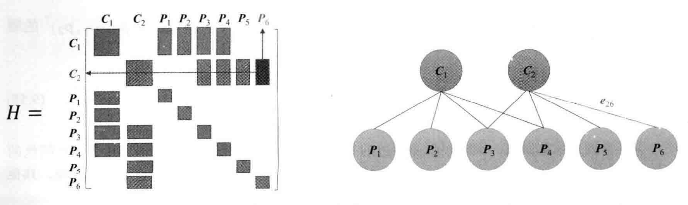
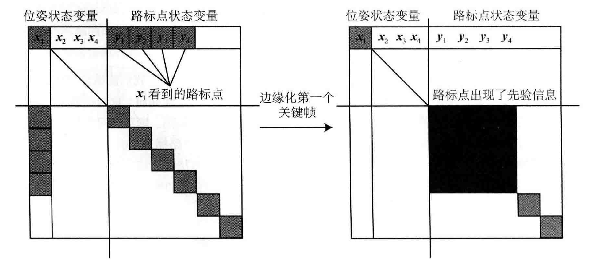

[TOC]

# 状态估计的概率解释

假设，在 $t=0$ 到 $t=N$ 的时间内，有位姿 $\boldsymbol{x}_0,\cdots,\boldsymbol{x}_N$ ，且有路标 $\boldsymbol{y}_1,\cdots,\boldsymbol{y}_M$ ，则有运动和观测方程
$$
\left\{\begin{array}{l}
\boldsymbol{x}_k=f(\boldsymbol{x}_{k-1},\boldsymbol{u}_k)+\boldsymbol{w}_k\\
\boldsymbol{z}_{k,j}=h(\boldsymbol{y}_j,\boldsymbol{x}_k)+\boldsymbol{v}_{k,j}
\end{array}\right.\quad k=1,\cdots,N;\quad j=1,\cdots,M
$$

* 只有当 $\boldsymbol{x}_k$ 看到了 $\boldsymbol{y}_j$ 时，才会产生观测数据；实际中观测方程数量会远远大于运动方程
* 可能没有运动方程；与 SfM 不同的是，SLAM 中的图像有时间上的先后顺序

把位姿 $\boldsymbol{x}$ 和路标 $\boldsymbol{y}$ 看作**服从某种概率分布的的随机变量**，则问题转化为：

* 拥有某些运动数据 $\boldsymbol{u}$ 和观测数据 $\boldsymbol{z}$ 时，如何确定状态量 $\boldsymbol{x},\boldsymbol{y}$ 的分布
* 得到新时刻的数据后它们的分布又作何变化
* 假设理想情况下状态量和噪声项服从高斯分布，则问题为当存在一些运动和观测数据时，如何估计状态量的高斯分布

令，$\boldsymbol{x}_k$ 为 $k$ 时刻的所有未知量，包含了当前时刻的相机位姿与 $m$ 个路标点
$$
\boldsymbol{x}_k\triangleq\{\boldsymbol{x}_k,\boldsymbol{y}_1,\cdots,\boldsymbol{y}_m\}
$$
把 $k$ 时刻的所有观测记作 $\boldsymbol{z}_k$ ，于是运动和观测方程
$$
\left\{\begin{array}{l}
\boldsymbol{x}_k=f(\boldsymbol{x}_{k-1},\boldsymbol{u}_k)+\boldsymbol{w}_k\\
\boldsymbol{z}_{k}=h(\boldsymbol{x}_k)+\boldsymbol{v}_{k}
\end{array}\right.\quad k=1,\cdots,N
$$
考虑 $k$ 时刻的情况，用过去 $0$ 到 $k$ 中的数据来估计现在的状态分布
$$
P(\boldsymbol{x}_k|\boldsymbol{x}_0,\boldsymbol{u}_{1:k},\boldsymbol{z}_{1:k})
$$
由贝叶斯法则
$$
P(\boldsymbol{x}_k|\boldsymbol{x}_0,\boldsymbol{u}_{1:k},\boldsymbol{z}_{1:k})\propto P(\boldsymbol{z}_k|\boldsymbol{x}_k)P(\boldsymbol{x}_k|\boldsymbol{x}_0,\boldsymbol{u}_{1:k},\boldsymbol{z}_{1:k-1})
$$
**似然**由**观测方程**给定，将**先验**以 $\boldsymbol{x}_{k-1}$ 时刻为条件概率展开
$$
P(\boldsymbol{x}_k|\boldsymbol{x}_0,\boldsymbol{u}_{1:k},\boldsymbol{z}_{1:k-1})=\int{P(\boldsymbol{x}_k|\boldsymbol{x}_{k-1},\boldsymbol{x}_0,\boldsymbol{u}_{1:k},\boldsymbol{z}_{1:k-1})P(\boldsymbol{x}_{k-1}|\boldsymbol{x}_0,\boldsymbol{u}_{1:k},\boldsymbol{z}_{1:k-1})\mathrm{d}\boldsymbol{x}_{k-1}}
$$
后续处理方法主要分两种路径：

* 假设**马尔可夫性**，得到以**扩展卡尔曼滤波（EKF）**为代表的滤波器方法，从某时刻的状态估计推导到下一个时刻
* 考虑当前时刻状态与之前**所有**状态的关系，得到以**非线性优化**为主体的优化框架

## 线性系统和 KF

如果假设了马尔可夫性，则有
$$
P(\boldsymbol{x}_k|\boldsymbol{x}_{k-1},\boldsymbol{x}_0,\boldsymbol{u}_{1:k},\boldsymbol{z}_{1:k-1})=P(\boldsymbol{x}_k|\boldsymbol{x}_{k-1},\boldsymbol{u}_k)\\
P(\boldsymbol{x}_{k-1}|\boldsymbol{x}_0,\boldsymbol{u}_{1:k},\boldsymbol{z}_{1:k-1})=P(\boldsymbol{x}_{k-1}|\boldsymbol{x}_0,\boldsymbol{u}_{1:k-1},\boldsymbol{z}_{1:k-1})
$$
在马尔可夫性的假设下，这一系列方程实际在做的是“如何把 $k-1$ 时刻的状态分布推导至 $k$ 时刻”这样一件事。也就是说，在程序运行期间，只要维护一个状态量，对它不断地进行迭代和更新即可。如果假设状态量服从**高斯分布**，那么只需考虑维护状态量的**均值**和**协方差**即可。

**线性高斯系统**：
$$
\left\{\begin{array}{l}
\boldsymbol{x}_k=\boldsymbol{A}_k\boldsymbol{x}_{k-1}+\boldsymbol{u}_k+\boldsymbol{w}_k\\
\boldsymbol{z}_{k}=\boldsymbol{C}_k\boldsymbol{x}_k+\boldsymbol{v}_k
\end{array}\right.\quad k=1,\cdots,N
$$
假设所有状态和噪声满足高斯分布
$$
\boldsymbol{w}_k\sim N(\boldsymbol{0},\boldsymbol{R})\quad \boldsymbol{v}_k\sim N(\boldsymbol{0},\boldsymbol{Q})
$$
利用马尔可夫性，假设，$k-1$ 时刻的**后验**状态估计 $\hat{\boldsymbol{x}}_{k-1}$ 及其协方差 $\hat{\boldsymbol{P}}_{k-1}$ 

目的：根据 $k$ 时刻的输入和观测数据，确定 $\boldsymbol{x}_k$ 的**后验**分布

**卡尔曼滤波器**的第一步**（预测）**：通过运动方程确定 $\boldsymbol{x}_k$ 的**先验**分布
$$
P(\boldsymbol{x}_k|\boldsymbol{x}_0,\boldsymbol{u}_{1:k},\boldsymbol{z}_{1:k-1})=N(\boldsymbol{A}_k\hat{\boldsymbol{x}}_{k-1}+\boldsymbol{u}_k,\boldsymbol{A}_k\hat{\boldsymbol{P}}_{k-1}\boldsymbol{A}_k^T+\boldsymbol{R})
$$
记
$$
\check{\boldsymbol{x}}_k=\boldsymbol{A}_k\hat{\boldsymbol{x}}_{k-1}+\boldsymbol{u}_k,\quad \check{\boldsymbol{P}}_k=\boldsymbol{A}_k\hat{\boldsymbol{P}}_{k-1}\boldsymbol{A}_k^T+\boldsymbol{R}
$$
由观测方程有
$$
P(\boldsymbol{z}_k|\boldsymbol{x}_k)=N(\boldsymbol{C}_k\boldsymbol{x}_k,\boldsymbol{Q})
$$
由此得到了先验与似然，计算其乘积即可，即使知道最后的结果是一个关于 $\boldsymbol{x}_k$ 的高斯分布，但计算上存在问题，将最后的结果设为 $\boldsymbol{x}_k\sim N(\hat{\boldsymbol{x}}_k,\hat{\boldsymbol{P}}_k)$ 
$$
N(\hat{\boldsymbol{x}}_k,\hat{\boldsymbol{P}}_k)=\eta N(\boldsymbol{C}_k\boldsymbol{x}_k,\boldsymbol{Q})\cdot N(\check{\boldsymbol{x}}_k,\check{\boldsymbol{P}}_k)
$$
将指数展开
$$
(\boldsymbol{x}-\hat{\boldsymbol{x}}_k)^T\hat{\boldsymbol{P}}_k^{-1}(\boldsymbol{x}_k-\hat{\boldsymbol{x}}_k)=(\boldsymbol{z}_k-\boldsymbol{C}_k\boldsymbol{x}_k)^T\boldsymbol{Q}^{-1}(\boldsymbol{z}_k-\boldsymbol{C}_k\boldsymbol{x}_k)+(\boldsymbol{x}_k-\check{\boldsymbol{x}}_k)^T\check{\boldsymbol{P}}_k^{-1}(\boldsymbol{x}_k-\check{\boldsymbol{x}}_k)
$$
为了求解 $\hat{\boldsymbol{x}}_k$ 和 $\hat{\boldsymbol{P}}_k$ ，将两边展开并比较 $\boldsymbol{x}_k$ 的二次和一次系数

对于**二次系数**
$$
\hat{\boldsymbol{P}}_k^{-1}=\boldsymbol{C}_k^T\boldsymbol{Q}^{-1}\boldsymbol{C}_k+\check{\boldsymbol{P}}_k^{-1}
$$
定义中间变量 $\boldsymbol{K}=\hat{\boldsymbol{P}}_k\boldsymbol{C}_k^T\boldsymbol{Q}^{-1}$ ，在上式两侧左乘 $\hat{\boldsymbol{P}}_k$ 
$$
\boldsymbol{I}=\hat{\boldsymbol{P}}_k\boldsymbol{C}_k^T\boldsymbol{Q}^{-1}\boldsymbol{C}_k+\hat{\boldsymbol{P}}_k\check{\boldsymbol{P}}_k^{-1}=\boldsymbol{KC}_k+\hat{\boldsymbol{P}}_k\check{\boldsymbol{P}}_k^{-1}
$$
于是
$$
\hat{\boldsymbol{P}}_k=(\boldsymbol{I}-\boldsymbol{KC}_k)\check{\boldsymbol{P}}_k
$$
对于**一次项系数**
$$
-2\hat{\boldsymbol{x}}_k^T\hat{\boldsymbol{P}}_k^{-1}\boldsymbol{x}_k=-2\boldsymbol{z}_k^T\boldsymbol{Q}^{-1}\boldsymbol{C}_k\boldsymbol{x}_k-2\check{\boldsymbol{x}}_k^T\check{\boldsymbol{P}}_k^{-1}\boldsymbol{x}_k
$$
整理得
$$
\hat{\boldsymbol{P}}_k^{-1}\boldsymbol{x}_k=\boldsymbol{C}_k^T\boldsymbol{Q}^{-1}\boldsymbol{z}_k+\check{\boldsymbol{P}}_k^{-1}\check{\boldsymbol{x}}_k
$$
则有
$$
\hat{\boldsymbol{x}}_k=\hat{\boldsymbol{P}}_k\boldsymbol{C}_k^T\boldsymbol{Q}^{-1}\boldsymbol{z}_k+\hat{\boldsymbol{P}}_k\check{\boldsymbol{P}}_k^{-1}\check{\boldsymbol{x}}_k=\boldsymbol{Kz}_k+(\boldsymbol{I}-\boldsymbol{KC}_k)\check{\boldsymbol{x}}_k=\check{\boldsymbol{x}}_k+\boldsymbol{K}(\boldsymbol{z}_k-\boldsymbol{C}_k\check{\boldsymbol{x}}_k)
$$
由此得到了后验**均值**与**协方差**的表示

**卡尔曼滤波**全过程

1. 预测：
   $$
   \check{\boldsymbol{x}}_k=\boldsymbol{A}_k\hat{\boldsymbol{x}}_{k-1}+\boldsymbol{u}_k,\quad \check{\boldsymbol{P}}_k=\boldsymbol{A}_k\hat{\boldsymbol{P}}_{k-1}\boldsymbol{A}_k^T+\boldsymbol{R}
   $$

2. 更新：

   * 先计算卡尔曼增益 $\boldsymbol{K}$ 
     $$
     \boldsymbol{K}=\check{\boldsymbol{P}}_k\boldsymbol{C}_k^T(\boldsymbol{C}_k\check{\boldsymbol{P}}_k\boldsymbol{C}_k^T+\boldsymbol{Q}_k)^{-1}
     $$

   * 计算后验概率分布
     $$
     \begin{array}{l}
     \hat{\boldsymbol{x}}_k=\check{\boldsymbol{x}}_k+\boldsymbol{K}(\boldsymbol{z}_k-\boldsymbol{C}_k\check{\boldsymbol{x}}_k)\\
     \hat{\boldsymbol{P}}_k=(\boldsymbol{I}-\boldsymbol{KC}_k)\check{\boldsymbol{P}}_k
     \end{array}
     $$

## 非线性系统和 EKF

SLAM 中的运动和观测方程通常是非线性函数，高斯分布经过非线性变换后往往不再是高斯分布

要将卡尔曼滤波器的结果扩展到非线性系统中，在某个点附近考虑运动方程及观测方程的一阶泰勒展开，只保留一阶项的线性部分，然后按照线性系统进行推导

令 $k-1$ 时刻的均值与协方差矩阵为 $\hat{\boldsymbol{x}}_{k-1},\hat{\boldsymbol{P}}_{k-1}$ ，在 $k$ 时刻，把运动和观测方程在 $\hat{\boldsymbol{x}}_{k-1},\hat{\boldsymbol{P}}_{k-1}$ 处进行**线性化**
$$
\boldsymbol{x}_k\approx f(\hat{\boldsymbol{x}}_{k-1},\boldsymbol{u}_k)+\left.\frac{\partial f}{\partial\boldsymbol{x}_{k-1}}\right|_{\hat{\boldsymbol{x}}_{k-1}}(\boldsymbol{x}_{k-1}-\hat{\boldsymbol{x}}_{k-1})+\boldsymbol{w}_k
$$
记偏导数为
$$
\boldsymbol{F}=\left.\frac{\partial f}{\partial\boldsymbol{x}_{k-1}}\right|_{\hat{\boldsymbol{x}}_{k-1}}
$$
对对于观测方程同理有
$$
\boldsymbol{z}_k\approx h(\check{\boldsymbol{x}}_{k})+\left.\frac{\partial h}{\partial\boldsymbol{x}_{k}}\right|_{\hat{\boldsymbol{x}}_{k}}(\boldsymbol{x}_{k}-\check{\boldsymbol{x}}_{k})+\boldsymbol{n}_k
$$
记偏导数为
$$
\boldsymbol{H}=\left.\frac{\partial h}{\partial\boldsymbol{x}_{k}}\right|_{\check{\boldsymbol{x}}_{k}}
$$
则，在预测步骤中，根据运动方程有
$$
P(\boldsymbol{x}_k|\boldsymbol{x}_0,\boldsymbol{u}_{1:k},\boldsymbol{z}_{1:k-1})=N(f(\hat{\boldsymbol{x}}_{k-1},\boldsymbol{u}_k),\boldsymbol{F}\hat{\boldsymbol{P}}_{k-1}\boldsymbol{F}^T+\boldsymbol{R}_k)
$$
记这里的**先验**和**协方差**的均值为
$$
\check{\boldsymbol{x}}_k=f(\hat{\boldsymbol{x}}_{k-1},\boldsymbol{u}_k),\quad \check{\boldsymbol{P}}_k=\boldsymbol{F}\hat{\boldsymbol{P}}_{k-1}\boldsymbol{F}^T+\boldsymbol{R}_k
$$
考虑观测方程
$$
P(\boldsymbol{z}_k|\boldsymbol{x}_k)=N(h(\check{\boldsymbol{x}}_k)+\boldsymbol{H}(\boldsymbol{x}_k-\check{\boldsymbol{x}}_k),\boldsymbol{Q}_k)
$$
同样地，定义**卡尔曼增益**
$$
\boldsymbol{K}_k==\check{\boldsymbol{P}}_k\boldsymbol{H}^T(\boldsymbol{H}\check{\boldsymbol{P}}_k\boldsymbol{H}^T+\boldsymbol{Q}_k)^{-1}
$$
在此基础上，后验为
$$
\begin{array}{l}
\hat{\boldsymbol{x}}_k=\check{\boldsymbol{x}}_k+\boldsymbol{K}_k(\boldsymbol{z}_k-h(\check{\boldsymbol{x}}_k))\\
\hat{\boldsymbol{P}}_k=(\boldsymbol{I}-\boldsymbol{K}_k\boldsymbol{H})\check{\boldsymbol{P}}_k
\end{array}
$$

## 关于 EKF

* 滤波器方法在一定程度上假设了**马尔可夫性**，如果当前帧确实与很久之前的数据有关 （ 例如回环 ） ， 那么滤波器会难以处理

* （主要问题）**非线性误差**：EKF 仅在 $\hat{\boldsymbol{x}}_{k-1}$ 处做了一次线性化，就直接根据这次线性化的结果， 把后验概率给算了出来 。但若运动模型和观测模型有强烈的非线性，那么线性近似就只在很小范围内成立，不能认为在很远的地方仍能用线性近似。

  可以粗略地认为，EKF 仅是优化中的一次迭代

* **不适用大型场景**：EKF 需要存储状态量的均值和方差，并对其进行维护和更新，若把路标也放入状态，由于视觉 SLAM 中路标数量很大，则这个存储量相当大，且与状态量呈平方增长（协方差矩阵）

* 滤波器没有异常检测机制，系统存在异常值时容易发散。在实用中不稳定

# BA 与图优化

Bundle Adjustment：从视觉图像中提炼出最优的 3D 模型和相机参数

## 投影模型和 BA 代价函数

世界坐标系中有一点 $\boldsymbol{p}$ 

1. 把**世界坐标**转换成相机坐标，使用外参 $(\boldsymbol{R},\boldsymbol{t})$ 
   $$
   \boldsymbol{P}'=\boldsymbol{Rp}+\boldsymbol{t}=[X',Y',Z']^T
   $$

2. 将 $\boldsymbol{P}'$ 投影到归一化平面，得到归一化坐标
   $$
   \boldsymbol{P}_c=[u_c,v_c,1]^T=[X'/Z',Y'/Z',1]^T
   $$

3. 考虑归一化坐标畸变（仅径向畸变）
   $$
   \left\{\begin{array}{l}
   u_c'=u_c(1+k_1r_c^2+k_2r_c^4)\\
   v_c'=v_c(1+k_1r_c^2+k_2r_c^4)
   \end{array}\right.
   $$

4. 根据内参模型，计算像素坐标
   $$
   \left\{\begin{array}{l}
   u_s=f_xu_c'+c_x\\
   v_s=f_yv_c'+c_y
   \end{array}\right.
   $$

整个投影过程实际上就是**观测方程**的表现，将其记作
$$
\boldsymbol{z}=h(\boldsymbol{x},\boldsymbol{y})
$$
其中，$\boldsymbol{x}$ 指代此时的相机位姿，路标 $\boldsymbol{y}$ 即三维点 $\boldsymbol{p}$ ，观测数据即像素坐标 $\boldsymbol{z}\triangleq[u_s,v_s]^T$ ，则这一次观测误差为
$$
\boldsymbol{e}=\boldsymbol{z}-h(\boldsymbol{x},\boldsymbol{y})
$$
考虑时刻，设 $\boldsymbol{z}_{ij}$ 为在位姿 $\boldsymbol{T}_i$ 处观察路标 $\boldsymbol{p}_j$ 产生的数据，那么整体的**代价函数**是
$$
\frac{1}{2}\sum_{i=1}^m{\sum_{j=1}^n{\|\boldsymbol{e}_{ij}\|^2}}=\frac{1}{2}\sum_{i=1}^m{\sum_{j=1}^n{\|\boldsymbol{z}_{ij}-h(\boldsymbol{T}_i,\boldsymbol{p}_j)\|^2}}
$$

## BA 求解

在整体 BA 目标函数上，应该把自变量定义成所有待优化的变量
$$
\boldsymbol{x}=[\boldsymbol{T}_1,\cdots,\boldsymbol{T}_m,\boldsymbol{p}_1\cdots,\boldsymbol{p}_n]^T
$$
则增量方程中的 $\Delta\boldsymbol{x}$ 是对整体自变量的增量，目标函数写作
$$
\frac{1}{2}\|f(\boldsymbol{x}+\Delta\boldsymbol{x})\|^2\approx\frac{1}{2}\sum_{i=1}^m{\sum_{j=1}^n{\|\boldsymbol{e}_{ij}+\boldsymbol{F}_{ij}\Delta\boldsymbol{\xi}_i+\boldsymbol{E}_{ij}\Delta\boldsymbol{p}_j\|^2}}
$$
其中，$\boldsymbol{F}_{ij}$ 表示整个**代价函数**在当前状态下对**相机姿态**的偏导数，$\boldsymbol{E}_{ij}$ 表示该函数对**路标点位置**的偏导

将相机姿态量与空间点分别构建出向量
$$
\boldsymbol{x}_c=[\boldsymbol{\xi}_1,\boldsymbol{\xi}_2,\cdots,\boldsymbol{\xi}_m]^T\in\mathbb{R}^{6m}\\
\boldsymbol{x}_p=[\boldsymbol{p}_1,\boldsymbol{p}_2,\cdots,\boldsymbol{p}_n]^T\in\mathbb{R}^{3n}
$$
则有
$$
\frac{1}{2}\|f(\boldsymbol{x}+\Delta\boldsymbol{x})\|^2=\frac{1}{2}\|\boldsymbol{e}+\boldsymbol{F}\Delta\boldsymbol{x}_c+\boldsymbol{E}\Delta\boldsymbol{x}_p\|^2
$$
在非线性优化中，最后都会面临增量线性方程：
$$
\boldsymbol{H}\Delta\boldsymbol{x}=\boldsymbol{g}
$$
而高斯牛顿法和列文伯格马夸尔特方法的主要差别在于 $\boldsymbol{H}$ 是取 $\boldsymbol{J}^T\boldsymbol{J}$ 还是 $\boldsymbol{J}^T\boldsymbol{J}+\lambda\boldsymbol{I}$ 

由于变量被归类成了位姿和空间点两种，因此雅可比矩阵可以分块为
$$
\boldsymbol{J}=\begin{bmatrix}\boldsymbol{F}&\boldsymbol{E}\end{bmatrix}
$$
以高斯牛顿法为例，则其 $\boldsymbol{H}$ 矩阵为
$$
\boldsymbol{H}=\boldsymbol{J}^T\boldsymbol{J}=\begin{bmatrix}\boldsymbol{F}^T\boldsymbol{F}&\boldsymbol{F}^T\boldsymbol{E}\\\boldsymbol{E}^T\boldsymbol{F}&\boldsymbol{E}^T\boldsymbol{E}\end{bmatrix}
$$
因为考虑了所有的优化变量，所以这个线性方程的维度将非常大，包含了所有的相机位姿和路标点。若直接对 $\boldsymbol{H}$ 求逆来计算增量方程，由于矩阵求逆是复杂度为 $O(n^3)$ 的操作，则消耗的计算资源会非常多

## 稀疏性和边缘化

$\boldsymbol{H}$ 矩阵的稀疏性是由雅可比矩阵 $\boldsymbol{J}(\boldsymbol{x})$ 引起的

考虑代价函数中的一个 $\boldsymbol{e}_{ij}$ ，该误差项只涉及了第 $i$ 个相机位姿和第 $j$ 个路标点，对其余部分的变量的导数都为0，则其对应雅可比矩阵有以下形式
$$
\boldsymbol{J}_{ij}(\boldsymbol{x})=\left(\boldsymbol{0}_{2\times6},\cdots,\boldsymbol{0}_{2\times6},\frac{\partial\boldsymbol{e}_{ij}}{\partial\boldsymbol{T}_i},\boldsymbol{0}_{2\times6},\cdots,\boldsymbol{0}_{2\times3},\cdots,\boldsymbol{0}_{2\times3},\frac{\partial\boldsymbol{e}_{ij}}{\partial\boldsymbol{p}_j},\boldsymbol{0}_{2\times3},\cdots,\boldsymbol{0}_{2\times3}\right)
$$
设 $\boldsymbol{J}_{ij}$ 只在 $i,j$ 处有非零块，那么它对 $\boldsymbol{H}$ 的贡献为 $\boldsymbol{J}_{ij}^T\boldsymbol{J}_{ij}$ ，具有稀疏形式，这个 $\boldsymbol{J}_{ij}^T\boldsymbol{J}_{ij}$ 矩阵也仅有4个非零块

对于整体的 $\boldsymbol{H}$ ，有
$$
\boldsymbol{H}=\sum_{i,j}{\boldsymbol{J}_{ij}^T\boldsymbol{J}_{ij}}
$$
对 $\boldsymbol{H}$ 进行分块
$$
\boldsymbol{H}=\begin{bmatrix}\boldsymbol{H}_{11}&\boldsymbol{H}_{12}\\\boldsymbol{H}_{21}&\boldsymbol{H}_{22}\end{bmatrix}
$$
其中，$\boldsymbol{H}_{11}$ 只与相机位姿有关，$\boldsymbol{H}_{22}$ 只与路标点有关

* 无论 $i,j$ 怎么变，$\boldsymbol{H}_{11}$ 都是对角阵，只在 $\boldsymbol{H}_{ii}$ 处有非零块
* 同理，$\boldsymbol{H}_{22}$ 也是对角阵，只在 $\boldsymbol{H}_{jj}$ 处有非零块
* 对于 $\boldsymbol{H}_{12},\boldsymbol{H}_{21}$ ，它们可能是稀疏的，也可能是稠密的

$\boldsymbol{H}$ 矩阵中的**非对角部分的非零矩阵块**，可以理解为其对应的两个变量之间存在联系，或称之为**约束**

### Marginalization

将组成 $\boldsymbol{H}$ 的四个矩阵快重新记作
$$
\boldsymbol{H}=\begin{bmatrix}\boldsymbol{B}&\boldsymbol{E}\\\boldsymbol{E}^T&\boldsymbol{C}\end{bmatrix}
$$
则对应线性方程组变为
$$
\begin{bmatrix}\boldsymbol{B}&\boldsymbol{E}\\\boldsymbol{E}^T&\boldsymbol{C}\end{bmatrix}\begin{bmatrix}\Delta\boldsymbol{x}_c\\\Delta\boldsymbol{x}_p\end{bmatrix}=\begin{bmatrix}\boldsymbol{v}\\\boldsymbol{w}\end{bmatrix}
$$

* 其中，$\boldsymbol{B}$ 是对角块矩阵，每个**对角块的维度**和**相机参数维度**相同，对角块个数是**相机变量**的个数
* 由于路标数量远大于相机变量个数，所有 $\boldsymbol{C}$ 往往也远大于 $\boldsymbol{B}$ 
* 三维空间中每个路标点为三维，于是 $\boldsymbol{C}$ 矩阵为对角块矩阵，每个块为 $3\times3$ 矩阵

对线性方程组进行高斯消元，目标是消去右上角的非对角部分 $\boldsymbol{E}$ 
$$
\begin{bmatrix}\boldsymbol{I}&-\boldsymbol{EC}^{-1}\\\boldsymbol{0}&\boldsymbol{I}\end{bmatrix}\begin{bmatrix}\boldsymbol{B}&\boldsymbol{E}\\\boldsymbol{E}^T&\boldsymbol{C}\end{bmatrix}\begin{bmatrix}\Delta\boldsymbol{x}_c\\\Delta\boldsymbol{x}_p\end{bmatrix}=\begin{bmatrix}\boldsymbol{I}&-\boldsymbol{EC}^{-1}\\\boldsymbol{0}&\boldsymbol{I}\end{bmatrix}\begin{bmatrix}\boldsymbol{v}\\\boldsymbol{w}\end{bmatrix}
$$
整理得到
$$
\begin{bmatrix}\boldsymbol{B}-\boldsymbol{EC}^{-1}\boldsymbol{E}^T&\boldsymbol{0}\\\boldsymbol{E}^T&\boldsymbol{C}\end{bmatrix}\begin{bmatrix}\Delta\boldsymbol{x}_c\\\Delta\boldsymbol{x}_p\end{bmatrix}=\begin{bmatrix}\boldsymbol{v}-\boldsymbol{EC}^{-1}\boldsymbol{w}\\\boldsymbol{w}\end{bmatrix}
$$
消元后方程组第一行与 $\Delta\boldsymbol{x}_p$ 无关，得到关于位姿部分的增量方程
$$
[\boldsymbol{B}-\boldsymbol{EC}^{-1}\boldsymbol{E}^T]\Delta\boldsymbol{x}_c=\boldsymbol{v}-\boldsymbol{EC}^{-1}\boldsymbol{w}
$$
这个线性方程的维度与 $\boldsymbol{B}$ 矩阵一样，其系数记作 $\boldsymbol{S}$，由此求得 $\Delta\boldsymbol{x}_c$ 之后代入原方程求解 $\Delta\boldsymbol{x}_p$ 

* 在消元过程中，由于 $\boldsymbol{C}$ 为对角块，所以 $\boldsymbol{C}^{-1}$ 容易解出
* 求解了 $\Delta\boldsymbol{x}_c$ 之后，路标部分的增量方程由 $\Delta\boldsymbol{x}_p=\boldsymbol{C}^{-1}(\boldsymbol{w}-\boldsymbol{E}^T\Delta\boldsymbol{x}_c)$ 给出，也用到了 $\boldsymbol{C}^{-1}$ 容易求解的特性

从概率角度看，这一步被称作边缘化，实际上是把求 $(\Delta\boldsymbol{x}_c,\Delta\boldsymbol{x}_p)$ 的问题，转化成了先固定 $\Delta\boldsymbol{x}_p$ 求出 $\Delta\boldsymbol{x}_c$ ，再求 $\Delta\boldsymbol{x}_p$ 的过程，相当于做了条件概率展开
$$
P(\boldsymbol{x}_c,\boldsymbol{x}_p)=P(\boldsymbol{x}_c|\boldsymbol{x}_p)P(\boldsymbol{x}_p)
$$
结果就是求出了关于 $\boldsymbol{x}_p$ 的边缘分布

## 鲁棒核函数

在 BA 问题中，目标函数是：**最小化误差项的二范数平方和**

存在问题：无法辨别由于误匹配等原因给出的错误数据

**鲁棒核函数**：保证图优化中每条边的误差不会过大从而掩盖其他的边。把原先误差的**二范数度量**替换成一个**增长没有那么快**的函数，同时保证自己的**光滑性质**以保证可导，使得整个优化结果更加稳健。

常用的 **Huber 核**：
$$
H(e)=\left\{\begin{array}{l}
\frac{1}{2}e^2&当|e|\le\delta\\
\delta\left(|e|-\frac{1}{2}\delta\right)&其他
\end{array}\right.
$$
当误差大于某个阈值 $\delta$ 之后，函数增长由二次形式变成了一次形式，相当于限制了梯度的最大值

# 滑动窗口滤波和优化

## 滑动窗口法

考虑一个滑动窗口内有 $N$ 个关键帧，它们的位姿表达为 $\boldsymbol{x}_1,\cdots,\boldsymbol{x}_N$ 

其中还有 $M$ 个路标点 $\boldsymbol{y}_1,\cdots,\boldsymbol{y}_M$ ，它们与关键帧组成了局部地图

使用 BA 方法处理滑动窗口，建立图优化模型，构建整体 Hessian 矩阵，边缘化所有路标点加速求解。边缘化时考虑相机位姿
$$
[\boldsymbol{x}_1,\cdots,\boldsymbol{x}_N]^T\sim N([\boldsymbol{\mu}_1,\cdots,\boldsymbol{\mu}_N]^T,\boldsymbol{\Sigma})
$$
其中，$\boldsymbol{\mu}_k$ 为第 $k$ 个关键帧的位姿均值（BA 迭代后的结果），$\boldsymbol{\Sigma}$ 为所有关键帧的协方差矩阵（对整个 BA 的 $\boldsymbol{H}$ 矩阵进行边缘化后的结果，即 $\boldsymbol{S}$ 矩阵）

在滑动窗口中，当窗口结构发生改变，状态量的变化可以分为两个部分

1. 在窗口中新增一个关键帧，以及它观测到的路标点
2. 把窗口中一个旧的关键帧删除，也可能删除它观测到的路标点

### 新增一个关键帧和路标点

新增关键帧 $\boldsymbol{x}_{N+1}$ ，按正常流程处理即可，对所有点进行边缘化时，即得到这 $N+1$ 个关键帧的高斯分布参数

### 删除一个旧的关键帧

滑动窗口删除关键帧将破坏路标部分的对角块结构

### SWF 中边缘化的直观解释

边缘化某个关键帧：保持这个关键帧**当前的估计值**，求其他状态变量以这个关键帧为条件的**条件概率**

当某个**关键帧被边缘化**，它观测到的路标点就会产生一个“**这些路标应该在哪里**”的先验信息 ， 从而影响其余部分的估计值。如果再**边缘化这些路标点** ， 那么它们的观测者将得到一个“**观测它们的关键帧应该在哪里**”的先验信息

从数学上看，当我们边缘化某个关键帧，整个窗口中的状态变量的描述方式将从**联合分布**变成一个**条件分布**
$$
p(\boldsymbol{x}_1,\cdots,\boldsymbol{x}_N,\boldsymbol{y}_1,\cdots,\boldsymbol{y}_M)=p(\boldsymbol{x}_2,\cdots,\boldsymbol{x}_N,\boldsymbol{y}_1,\cdots,\boldsymbol{y}_M|\boldsymbol{x}_1)p(\boldsymbol{x}_1)
$$
然后舍去被边缘化部分的信息

# 位姿图

构建一个**只有轨迹的图优化**， 而位姿节点之间的边， 可以由两个关键帧之间通过特征匹配之后得到的**运动估计**来给定初始值。不同的是，一旦初始估计完成，就不再优化那些路标点的位置，而只关心所有的**相机位姿之间的联系**。通过这种方式，省去了大量的特征点优化的计算，只保留了关键帧的轨迹，从而构建了所谓的**位姿图 （Pose Graph ）** 

## 位姿图的优化

位姿图优化中的节点表示**相机位姿**：$\boldsymbol{T}_1,\cdots,\boldsymbol{T}_n$ 

边是两个位姿节点之间**相对运动的估计**，可以来自特征点法或直接法，也可来自 GPS 或 IMU 积分：$\Delta\boldsymbol{T}_{ij}$ ，将其表达为
$$
\Delta\boldsymbol{\xi}_{ij}=\boldsymbol{\xi}_i^{-1}\circ\boldsymbol{\xi}_j=\ln(\boldsymbol{T}_i^{-1}\boldsymbol{T}_j)^\vee
$$
或写成李群
$$
\boldsymbol{T}_{ij}=\boldsymbol{T}_i^{-1}\boldsymbol{T}_j
$$
设立最小二乘误差，构建误差
$$
\boldsymbol{e}_{ij}=\Delta\boldsymbol{\xi}_{ij}\ln(\boldsymbol{T}_{ij}^{-1}\boldsymbol{T}_i^{-1}\boldsymbol{T}_j)^\vee
$$
求 $\boldsymbol{e}_{ij}$ 关于 $\boldsymbol{\xi}_i,\boldsymbol{\xi}_j$ 两个变量的导数，给它们各自加一个左扰动 $\delta\boldsymbol{\xi}_i,\delta\boldsymbol{\xi}_j$ 
$$
\hat{\boldsymbol{e}}_{ij}=\ln(\boldsymbol{T}_{ij}^{-1}\boldsymbol{T}_i^{-1}\exp((-\delta\boldsymbol{\xi}_i)^\wedge)\exp(\delta\boldsymbol{\xi}_j^\wedge)\boldsymbol{T}_j)^\vee
$$
根据**伴随性质**
$$
\boldsymbol{R}\exp(\boldsymbol{p}^\wedge)\boldsymbol{R}^T=\exp((\boldsymbol{Rp})^\wedge)\\
\boldsymbol{T}\exp(\boldsymbol{\xi}^\wedge)\boldsymbol{T}^{-1}=\exp((\mathrm{Ad}(\boldsymbol{T})\boldsymbol{\xi})^\wedge)
$$
其中
$$
\mathrm{Ad}(\boldsymbol{T})=\begin{bmatrix}\boldsymbol{R}&\boldsymbol{t}^\wedge\boldsymbol{R}\\\boldsymbol{0}&\boldsymbol{R}\end{bmatrix}
$$
有
$$
\exp(\boldsymbol{\xi}^\wedge)\boldsymbol{T}=\boldsymbol{T}\exp((\mathrm{Ad}(\boldsymbol{T}^{-1})\boldsymbol{\xi})^\wedge)
$$
该式表明，通过引入伴随项，能够交换扰动项左右侧的 $\boldsymbol{T}$ ，通过伴随性质可以将扰动移到最右（最左），从而利用 BCH 近似导出右乘（左乘）形式的雅可比矩阵
$$
\begin{split}
\hat{\boldsymbol{e}}_{ij}&=\ln(\boldsymbol{T}_{ij}^{-1}\boldsymbol{T}_i^{-1}\exp((-\delta\boldsymbol{\xi}_i)^\wedge)\exp(\delta\boldsymbol{\xi}_j^\wedge)\boldsymbol{T}_j)^\vee\\
&=\ln(\boldsymbol{T}_{ij}^{-1}\boldsymbol{T}_i^{-1}\boldsymbol{T}_j\exp((-\mathrm{Ad}(\boldsymbol{T}_j^{-1})\delta\boldsymbol{\xi}_i)^\wedge)\exp((\mathrm{Ad}(\boldsymbol{T}_j^{-1})\delta\boldsymbol{\xi}_j)^\wedge))^\vee\\
&\approx\ln(\boldsymbol{T}_{ij}^{-1}\boldsymbol{T}_i^{-1}\boldsymbol{T}_j[\boldsymbol{I}-(-\mathrm{Ad}(\boldsymbol{T}_j^{-1})\delta\boldsymbol{\xi}_i)^\wedge+(\mathrm{Ad}(\boldsymbol{T}_j^{-1})\delta\boldsymbol{\xi}_j)^\wedge])^\vee\\
&\approx\boldsymbol{e}_{ij}+\frac{\partial\boldsymbol{e}_{ij}}{\partial\delta\boldsymbol{\xi}_i}\delta\boldsymbol{\xi}_i+\frac{\partial\boldsymbol{e}_{ij}}{\partial\delta\boldsymbol{\xi}_j}\delta\boldsymbol{\xi}_j
\end{split}
$$
由此得到误差关于两个位姿的雅可比矩阵
$$
关于 \boldsymbol{T}_i 的\quad \frac{\partial\boldsymbol{e}_{ij}}{\partial\delta\boldsymbol{\xi}_i}=-\mathcal{J}_r^{-1}(\boldsymbol{e}_{ij})\mathrm{Ad}(\boldsymbol{T}_j^{-1})\\
关于 \boldsymbol{T}_j 的\quad \frac{\partial\boldsymbol{e}_{ij}}{\partial\delta\boldsymbol{\xi}_j}=\mathcal{J}_r^{-1}(\boldsymbol{e}_{ij})\mathrm{Ad}(\boldsymbol{T}_j^{-1})
$$
由于 $\mathfrak{se}(3)$ 上的左右雅可比 $\mathcal{J}_r$ 形式过于复杂，通常取其近似，若误差接近零，就可以设它们近似为 $\boldsymbol{I}$ 或
$$
\mathcal{J}_r^{-1}(\boldsymbol{e}_{ij})\approx\boldsymbol{I}+\frac{1}{2}\begin{bmatrix}\phi_e^\wedge&\rho_e^\wedge\\\boldsymbol{0}&\phi_e^\wedge\end{bmatrix}
$$
则，所有位姿顶点和位姿-位姿边构成了一个图优化，本质上是一个最小二乘问题，优化变量为各个顶点的位姿，边来自于位姿观测约束。记 $\mathcal{E}$ 为所有边的集合，则总体目标函数为
$$
\min{\frac{1}{2}\sum_{i,j\in \mathcal{E}}{\boldsymbol{e}_{ij}^T\Sigma_{ij}^{-1}\boldsymbol{e}_{ij}}}
$$
