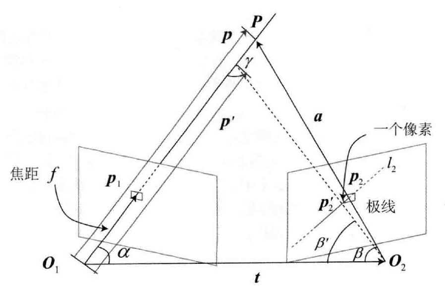
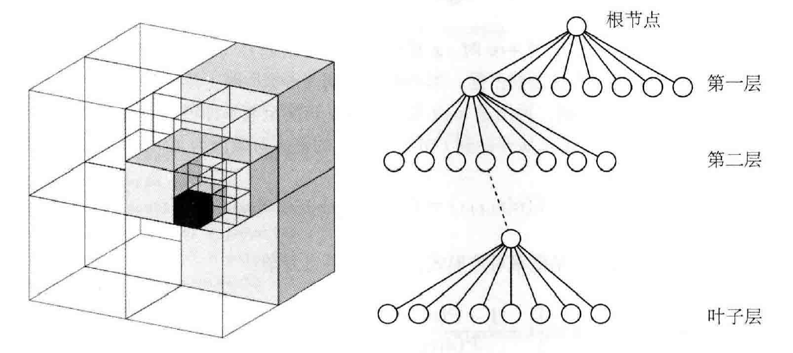

[TOC]

# 一些概念

从**视觉 SLAM** 的角度看，“建图”是服务于“定位”的；但是从**应用**层面看，“建图”明显带有许多其他的需求。

* **定位**：定位是地图的一项基本功能。在**视觉里程计**部分，讨论了如何利用局部地图实现定位。在**回环检测**部分，只要有全局的描述子信息，也能通过回环检测确定机器人的位置。在此之上，还希望能够**把地图保存下来**，让机器人在下次开机后依然能在地图中定位，这样只需对地图进行一次建模，而不是每次启动机器人都重新做一次完整的 SLAM 导航 。 
* **导航**：导航是指机器人能够在地图中进行**路径规划**，在任意两个地图点间寻找路径，然后**控制自己运动到目标点**的过程 。 在该过程中，我们至少需要知道地图中哪些地方不可通过，而哪些地方是可以通过的。这就超出了稀疏特征点地图的能力范围，必须有另外的地图形式，至少得是一种稠密的地图。
* **避障**：与导航类似，但更注重**局部的、动态的障碍物**的处理。同样，仅有特征点，无法判断某个特征点是否为障碍物，所以需要稠密地图。
* **重建**：有时会希望利用 SLAM 获得周围环境的**重建效果**。这种地图主要用于向人展示，所以希望它看上去比较舒服、美观或者，也可以把该地图用于通信，使其他人能够远程观看重建得到的三维物体或场景一一例如三维的视频通话或者网上购物等。这种地图亦是**稠密的** ， 并且还对它的外观有一些要求，可能不满足于稠密点云重建，更希望能够构建**带纹理的平面**，就像电子游戏中的三维场景那样。
* **交互**：交互主要指人与地图之间的互动。例如，在**增强现实**中，会在房间里放置虚拟的物体，并与这些虚拟物体之间有一些互动一一例如用户会点击墙面上放着的虚拟网页浏览器来观看视频，或者向墙面投掷物体，希望它们有（虚拟的）物理碰撞。另外，**机器人应用**中也会有与人、与地图之间的交互。例如，机器人可能会收到命令“取桌子上的报纸”，那么，除了有环境地图，机器人还需要知道哪一块地图是“桌子”，什么叫作“之上”，什么叫作“报纸”。这就需要机器人对地图有更高层面的认知一一也称为**语义地图**

# 单目稠密重建

## 立体视觉

相机被认为是**只有角度**的传感器（Bearing Only）：单幅图像中的像素，只能提供物体与相机成像平面的角度及物体采集到的**亮度**，而无法提供物体的**距离（Range）**

**需求**：而在稠密重建中，需要知道每一个像素点（或大部分像素点）的**距离**

**解决方案**：

* 使用**单目相机**，估计相机**运动**，并且三角化计算像素的距离
* 使用**双目相机**，利用左右目的**视差**计算像素的距离（多目原理相同）
* 使用 RGB-D 相机直接获得像素距离

## 极线搜索与块匹配

对于一个空间点，其在左视图上的投影为 $p_1$ ，在已知相机运动的情况下能够知道右视图上的极线

**块匹配**：由于单个像素的亮度没有区分性，比较像素块，在 $p_1$ 周围取一个大小为 $w\times w$ 的小块，然后在**极线**上也取很多**同样大小的小块**进行比较，就可以在一定程度上提高区分性。在这个过程中 ， 只有假设在不同图像间整个小块的假设在不同图像间整个小块的灰度值不变 ， 这种比较才有意义，所以算法的假设从**像素的灰度不变性**变成了**图像块的灰度不变性**

取 $p_1$ 周围一个大小为 $w\times w$ 的小块，记作 $\boldsymbol{A}\in\mathbb{R}^{w\times w}$ ，同样将极线也划分成 $n$ 个小块 $\boldsymbol{B}_i,i=1,\cdots,n$ 

* SAD (Sum of Absolute Difference) 绝对差之和
  $$
  S(\boldsymbol{A},\boldsymbol{B})_{\mathrm{SAD}}=\sum_{i,j}{|\boldsymbol{A}(i,j)-\boldsymbol{B}(i,j)|}
  $$

* SSD (Sum of Squared Distance) 平方和
  $$
  S(\boldsymbol{A},\boldsymbol{B})_{\mathrm{SSD}}=\sum_{i,j}{(\boldsymbol{A}(i,j)-\boldsymbol{B}(i,j))^2}
  $$

* NCC (Normalized Cross Correlation) 归一化互相关
  $$
  S(\boldsymbol{A},\boldsymbol{B})_{\mathrm{NCC}}=\frac{
  \sum_{i,j}{\boldsymbol{A}(i,j)\boldsymbol{B}(i,j)}}{\sqrt{\sum_{i,j}{\boldsymbol{A}(i,j)^2}\sum_{i,j}{\boldsymbol{B}(i,j)^2}}}
  $$
  相关性越接近0，表示两幅图像越不相似

**去均值**：可以先把每个小块的均值去掉，称为去均值的 SSD/NCC/... 去掉均值之后，允许像“**小块 B 比 A 整体上亮一些，但仍然很相似**”这样的情况，因此比之前的更可靠。

于是，在极线上计算了 $\boldsymbol{A}$ 与每一个 $\boldsymbol{B}_i$ 的相似性度量，得到一个沿着极线的相似性度量分布

## 高斯分布的深度滤波器

对像素点深度的估计，本身也可建模为一个状态估计问题，于是就自然存在**滤波器**与**非线性优化**两种求解思路。

虽然**非线性优化效果较好**，但是在 SLAM 这种**实时性要求较强**的场合，考虑到前端已经占据了不少的计算量，建图方面则通常采用**计算量较少的滤波器方式**。

设某个像素点的深度服从
$$
P(d)=N(\mu,\sigma^2)
$$
当新数据到来，新的观测也是高斯分布
$$
P(d_\mathrm{obs})=N(\mu_\mathrm{obs},\sigma_\mathrm{obs}^2)
$$
于是问题（**信息融合问题**）就是：如何使用观测的信息更新原先 $d$ 的分布。

已知：**两个高斯分布的乘积依然是一个高斯分布**

设：融合后的 $d$ 的分布为 $N(\mu_\mathrm{fuse},\sigma_\mathrm{fuse}^2)$ 
$$
\mu_\mathrm{fuse}=\frac{\sigma_\mathrm{obs}^2\mu+\sigma^2\mu_\mathrm{obs}}{\sigma^2+\sigma_\mathrm{obs}^2},\quad \sigma_\mathrm{obs}^2=\frac{\sigma^2\sigma_\mathrm{obs}^2}{\sigma^2+\sigma_\mathrm{obs}^2}
$$
问题在于：如何确定观测到的深度的分布 $\mu_\mathrm{obs},\sigma_\mathrm{obs}$ 

考虑**几何关系**带来的不确定性，假设通过极线搜索和块匹配确定了参考帧某个像素在当前帧的投影位置，该位置对深度的不确定性

考虑某次极线搜索，找到了 $\boldsymbol{p}_1$ 对应的 $\boldsymbol{p}_2$ 点，从而观测到了 $\boldsymbol{p}_1$ 的深度值，认为 $\boldsymbol{p}_1$ 对应的三维点为 $\boldsymbol{P}$ 。从而，可记 $\boldsymbol{O}_1\boldsymbol{p}$ 为 $\boldsymbol{p}$ ，$\boldsymbol{O}_1\boldsymbol{O}_2$ 为相机的平移 $\boldsymbol{t}$ ， $\boldsymbol{O}_2\boldsymbol{P}$ 记为 $\boldsymbol{a}$ 。并且，把这个三角形的下面两个角记作 $\alpha,\beta$ 。现在，考虑极线 $l_2$ 上存在一个像素大小的误差，使得 $\beta$ 角变成了 $\boldsymbol{\beta}'$ ，而 $\boldsymbol{p}_2$ 也变成了 $\boldsymbol{p}_2'$ ，并记上面那个角为 $\gamma$ 。 问题则是，这个像素的误差会导致 $\boldsymbol{p}$ 与 $\boldsymbol{p}'$ 产生多大的差距呢？

有
$$
\boldsymbol{a}=\boldsymbol{p}-\boldsymbol{t}\\
\alpha=\arccos\langle\boldsymbol{p},\boldsymbol{t}\rangle\\
\beta=\arccos\langle\boldsymbol{a},-\boldsymbol{t}\rangle
$$
对 $\boldsymbol{p}_2$ 扰动一个像素，将使得 $\beta$ 产生一个变化量，成为 $\beta'$ 。根据几何关系，有
$$
\beta'=\arccos\langle\boldsymbol{O}_2\boldsymbol{p_2'},-\boldsymbol{t}\rangle\\
\gamma=\pi-\alpha-\beta'
$$
由正弦定理可以求得 $\boldsymbol{p}'$ 的大小
$$
\|\boldsymbol{p}'\|=\|\boldsymbol{t}\|\frac{\sin\beta'}{\sin\gamma'}
$$
如果认为极限搜索的块匹配仅有一个像素的误差，那么可以设
$$
\sigma_\mathrm{obs}=\|\boldsymbol{p}\|-\|\boldsymbol{p}'\|
$$
于是得到稠密深度估计的完整过程：

1. 假设所有像素的深度满足某个**初始的高斯分布**
2. 当新数据产生时，通过**极线搜索和块匹配**确定投影点位置
3. 根据几何关系计算三角化后的**深度及不确定性**
4. 将当前观测**融合**进上一次的估计中。若收敛则停止计算，否则返回第 2 步

**注意**：这里提到的深度是 $\boldsymbol{O}_1\boldsymbol{p}$ ，并非针孔相机模型中的深度 $z$ 值

# 一些问题

## 像素梯度

* 块匹配的正确与否依赖于图像块是否具有区分度
* 立体视觉的重建质量**十分依赖于环境纹理**，在进行块匹配（和 NCC 的计算）时，必须假设小块不变，然后将该小块与其他小块进行对比
  * 有**明显梯度**的小块将具有良好的区分度，不易引起误匹配，得到的深度信息也相对准确
  * 对于**梯度不明显**的像素，由于在块匹配时没有区分性，将难以有效地估计其深度。
* 像素梯度垂直于极线方向：即使小块有明显梯度，沿着极线做块匹配时匹配程度都是一样的，因此得不到有效的匹配
* 像素梯度平行于极线方向：能够精确地确定匹配度最高点出现在何处
  * 当像素梯度与极线夹角较大时，极线匹配的不确定性大，而当夹角较小时，匹配的不确定性变小。

## 逆深度

描述一个空间点的两种方式：

* 世界坐标 $x,y,z$ （三者存在明显的相关性，协方差矩阵中非对角元素不为零）
* 图像坐标 $u,v$ 和深度 $d$  （坐标与深度近似独立，也可以认为 $u,v$ 独立，从而协方差矩阵近似为对角阵）

假设深度值满足高斯分布 $d\sim N(\mu,\sigma^2)$ 存在的问题：

* 实际想表达的是：这个场景深度大概是 5~10 米，可能有一些更远的点，但近处肯定不会小于相机焦距（或认为深度不会小于 0 ）。这个分布并不是像高斯分布那样，形成一个对称的形状。它的**尾部可能稍长，而负数区域则为零**
* 在一些室外应用中，可能存在距离非常远，乃至无穷远处的点。初始值中难以涵盖这些点，并且用高斯分布描述它们会有一些数值计算上的困难

假设**逆深度**（深度的倒数）符合高斯分布可以有效解决以上的问题

## 图像变换

假设了图像小块在相机运动时保持不变，而这个假设在相机平移时能够保持成立，但当相机发生明显的旋转时，就难以继续保持了。

因此，通常需要在块匹配之前，把**参考帧与当前帧之间的运动**考虑进来。

参考帧上的一个像素 $\boldsymbol{P}_\mathrm{R}$ 与真实的三维点世界坐标 $\boldsymbol{P}_\mathrm{W}$ 有以下关系：
$$
d_\mathrm{R}\boldsymbol{P}_\mathrm{R}=\boldsymbol{K}(\boldsymbol{R}_\mathrm{RW}\boldsymbol{P}_\mathrm{W}+\boldsymbol{t}_\mathrm{RW})
$$
类似的，对于当前帧，亦有 $\boldsymbol{P}_\mathrm{W}$ 在它上边的投影，记作 $\boldsymbol{P}_\mathrm{C}$ 
$$
d_\mathrm{C}\boldsymbol{P}_\mathrm{C}=\boldsymbol{K}(\boldsymbol{R}_\mathrm{CW}\boldsymbol{P}_\mathrm{W}+\boldsymbol{t}_\mathrm{CW})
$$
代入消去 $\boldsymbol{P}_\mathrm{W}$ 得
$$
d_\mathrm{C}\boldsymbol{P}_\mathrm{C}=d_\mathrm{R}\boldsymbol{K}\boldsymbol{R}_\mathrm{CW}\boldsymbol{R}_\mathrm{RW}^T\boldsymbol{K}^{-1}\boldsymbol{P}_\mathrm{R}+\boldsymbol{Kt}_\mathrm{CW}-\boldsymbol{KR}_\mathrm{CW}\boldsymbol{R}_\mathrm{RW}^T\boldsymbol{Kt}_\mathrm{RW}
$$
当已知 $d_\mathrm{R},\boldsymbol{P}_\mathrm{R}$ 时，可以计算出 $\boldsymbol{P}_\mathrm{C}$ 的投影位置。而再给 $\boldsymbol{P}_\mathrm{R}$ 两个分量各一个增量 $\mathrm{d}u,\mathrm{d}v$ ，就可以求得 $\boldsymbol{P}_\mathrm{C}$ 的增量 $\mathrm{d}u_\mathrm{c},\mathrm{d}v_\mathrm{c}$ 

于是，就可以算出在局部范围内参考帧和当前帧图像坐标变换的一个线性关系构成仿射变换
$$
\begin{bmatrix}\mathrm{d}u_\mathrm{c}\\\mathrm{d}v_\mathrm{c}\end{bmatrix}=\begin{bmatrix}\frac{\mathrm{d}u_\mathrm{c}}{\mathrm{d}u}&\frac{\mathrm{d}u_\mathrm{c}}{\mathrm{d}v}\\\frac{\mathrm{d}v_\mathrm{c}}{\mathrm{d}u}&\frac{\mathrm{d}v_\mathrm{c}}{\mathrm{d}v}\end{bmatrix}\begin{bmatrix}\mathrm{d}u\\\mathrm{d}v\end{bmatrix}
$$
根据仿射变换矩阵，可以将当前帧（或参考帧）的像素进行变换，再进行块匹配，以期获得对旋转更好的效果

## 其他改进

* **并行化**：这几十万个像素点的深度估计彼此无关，这使并行化有了用武之地
* **平滑**：假设深度图中相邻的深度变化不会太大，从而给深度估计加上了空间正则项。这种做法会使得到的深度图更加平滑
* **容错**：由于遮挡、光照、运动模糊等各种因素的影响，不可能对每个像素都保持成功匹配。

# RGB-D 稠密建图

* 深度在 RGB-D 相机中可以完全通过传感器中硬件的测量得到，无须消耗大量的计算资源来估计
* RGB-D 的结构光或飞时原理，保证了深度数据对纹理的无关性。即使面对纯色的物体，只要它能够反射光，就能测量到它的深度

建图方式：

* 根据估算的相机位姿，将 RGB-D 数据转化为点云，然后进行拼接，最后得到一个**由离散的点组成的点云地图**
* 在此基础上，如果对外观有进一步要求，希望估计物体的表面，则可以使用三角网格（Mesh）、面片（Surfel）进行建图
* 如果希望知道地图的障碍物信息并在地图上导航，也可通过体素（Voxel）建立占据网格地图（Occupancy Map）

## 点云地图

* 点云地图提供了比较基本的可视化地图，能够大致了解环境的样子

* 以三维方式存储，能够快速地浏览场景的各个角落，乃至在场景中进行漫游
* 一大优势是可以直接由 RGB-D 图像**高效地生成**，不需要额外处理。
* 滤波操作也非常直观，且处理效率尚能接受

点云地图对地图需求的满足：

* **定位需求**：取决于前端视觉里程计的处理方式。如果是基于特征点的视觉里程计，由于点云中没有存储特征点信息，则无法用于基于特征点的定位方法。如果前端是点云的 ICP ，那么可以考虑**将局部点云对全局点云进行 ICP** 以估计位姿。然而  这要求全局点云具有较好的精度。处理点云的方式并没有对点云本身进行优化，所以是不够的。
* **导航与避障的需求**：**无法直接用于导航和避障**。纯粹的点云无法表示“**是否有障碍物**”的信息，也无法在点云中做“**任意空间点是否被占据**”这样的查询，而这是导航和避障的基本需要。不过，可以在点云基础上进行加工，得到更适合导航与避障的地图形式
* **可视化和交互**：具有基本的可视化与交互能力。能够看到场景的外观，也能在场景里漫游。从可视化角度来说，由于点云只含有离散的点，**没有物体表面信息（例如法线）**，所以不太符合人们的可视化习惯。例如，从正面和背面看点云地图的物体是一样的，而且还能透过物体看到它背后的东西：这些都不太符合我们日常的经验

综上所述，说点云地图是“基础的”或“初级的”，是指它**更接近传感器读取的原始数据**。它具有一些基本的功能，但通常用于调试和基本的显示，不便直接用于应用程序

点云地图更适合作为一些高级功能的出发点：构建占据网格地图、泊松重建等

## 八叉树地图

点云的缺陷：

*  规模大，且存在较多冗余信息
* 无法处理运动物体

在八叉树中，在节点中存储它**是否被占据**的信息。当某个方块的所有子节点都被占据或都不被占据时，就**没必要展开**这个节点

一开始地图为空白时，只需一个根节点，不需要完整的树。当向地图中添加信息时，由于实际的物体经常连在一起，空白的地方也会常常连在一起，所以大多数八叉树节点无须展开到叶子层面。所以八叉树比点云节省大量的存储空间

用**概率形式**表达某节点是否被占据的事实。 例如，用一个浮点数 $x\in[0,1]$ 来表达。这个 $x$ 一开始取 0.5， 如果不断观测到它被占据，那么让这个值不断增加；反之，如果不断观测到它是空白，那就让它不断减小即可

这种方式可能导致 $x$ 值离开 $[0,1]$ 区间，带来处理上的不便，因此使用**概率对数值（Log-odds）**来描述 

设 $y\in\mathbb{R}$ 为概率对数值，$x$ 为 $0\sim1$ 的概率，则它们之间的变换由 logit 变换描述：
$$
y=\mathrm{logit}(x)=\log\left(\frac{x}{1-x}\right)
$$
其反变换为
$$
x=\mathrm{logit}^{-1}(y)=\frac{\exp(y)}{\exp(y)+1}
$$
在表达观测对占据概率的影响时，对概率对数值进行加减；而在需要查询概率时，则对概率对数值做反变换即可

设某节点为 $n$ ，观测数据为 $z$ ，那么从开始到 $t$ 时刻某节点的概率对数值为 $L(n|z_{1:t})$ ，$t+1$ 时刻为
$$
L(n|z_{1:t+1})=L(n|z_{1:t-1})+L(n|z_t)
$$
有了对数概率，就可以根据 RGB-D 数据更新整个八叉树地图了：

* 假设在 RGB-D 图像中观测到某个像素带有深度 $d$ ，就说明：

  * **在深度值对应的空间点上观察到了一个占据数据**
  * **并且，从相机光心出发到这个点的线段上应该是没有物体的（否则会被遮挡）。**

  利用这个信息，可以很好地对八叉树地图进行更新，并且能处理运动的结构
